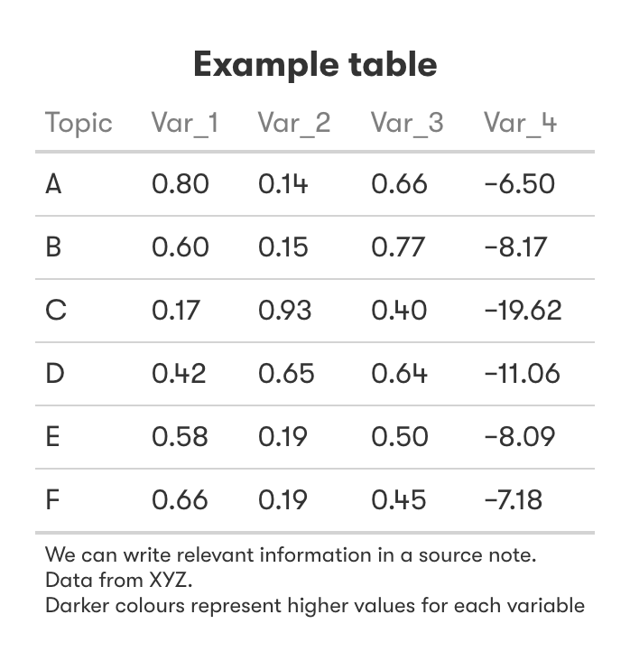
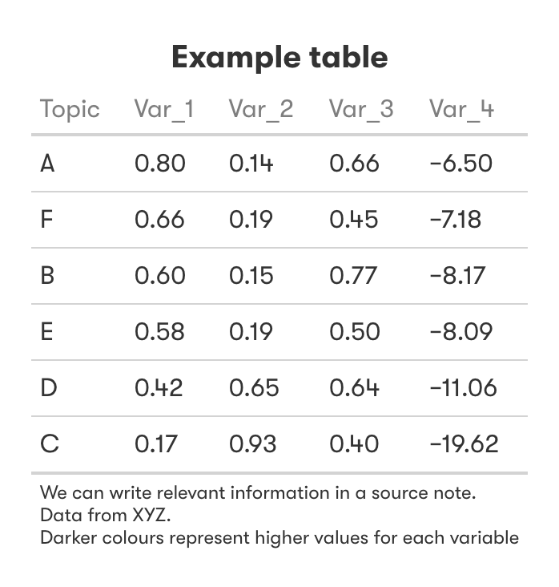
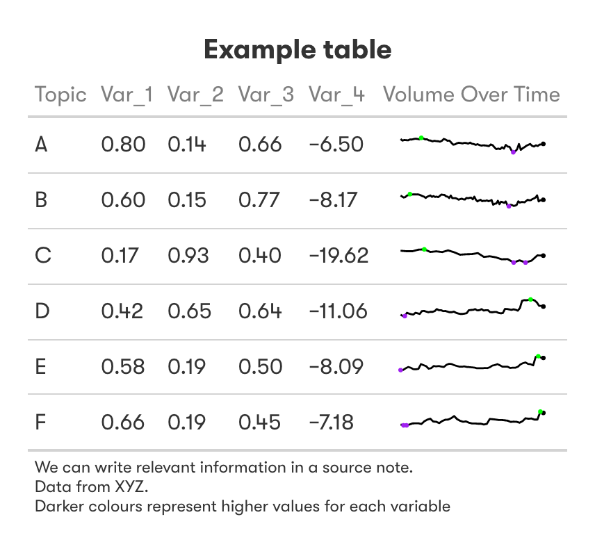
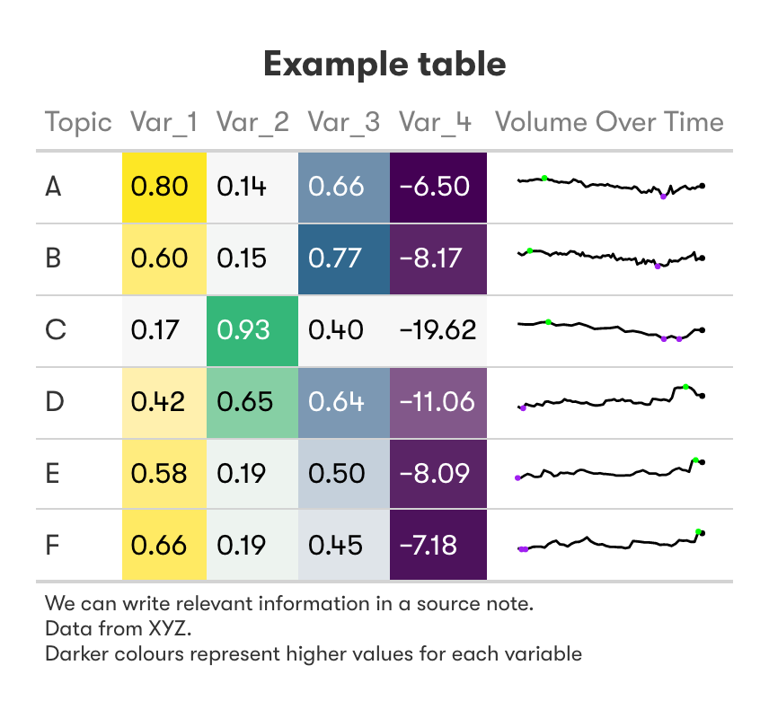

--- 
title: "Capture Cookbook 📈🧑‍🍳"
author: "Capture Intelligence Data Science Team"
date: "*Last updated: `r Sys.Date()`*"
output: 
  rmdformats::readthedown:
    css: custom.css
    toc_depth: 2
    code_folding: hide
    use_bookdown: true
---

```{r setup, include=FALSE}
knitr::opts_chunk$set(echo = FALSE,
                      fig.align="center",
                      message = FALSE,
                      warning = FALSE)

library(tidyverse)
library(lubridate)
library(scales)
library(patchwork)
library(ggrepel)
library(ggtext)
library(forcats)
library(gtable)
library(gtExtras)
library(gt)
library(gghighlight)
library(treemapify)
library(rivendell)
library(formatR)
library(circlize)
library(chorddiag)
library(viridis)
```

# About the Capture Cookbook 

The aim of this document is to serve as a valuable resource for everyone at SHARE Creative or Capture Intelligence, enabling them to understand the commonly used visualisations created for client projects. It is important to appreciate when and how to use these visualisations, as well as how to interpret them.

The BBC has provided an excellent summary of this topic in their own graphics cookbook:

>A reference manual, rather than a tutorial, it might not tell you how to make your very first chart in R, but is a useful collection of little tips and tricks.

In line with this, this document will not teach you R or the technical aspects of creating these plots. Whilst there is some code provided for some plots- showing 'how the plots are made', there is minimum explanation of the code in the hope of avoiding boilerplate and to try and make this document as coding language/software-agnostic as possible. Instead, its primary goal is to help you grasp the purpose and appropriate usage of visualisations in our work. By doing so, it empowers everyone to confidently explain the key insights, strengths, and weaknesses conveyed by different types of plots. Once the building blocks of this are in place, it is much easier to apply this knowledge to different coding languages and software. 

```{r, echo = TRUE, class.source = 'fold-show', eval = FALSE, tidy=TRUE, tidy_source(width.cutoff = 60)}
# The code blocks can be accessed by clicking `code`/`hide` towards the right hand side of each block. Alternatively, at the top of the page is an option to open up all code blocks at once. 
```

:::: {.blackbox data-latex=""}
::: {.center data-latex=""}
**Note**
:::

If you do look at the code for the plots, you will notice many plots use a function called `theme_capture()`. This is not yet available for wider use, but will eventually appear in the `DisplayR` package to enable consistent 'Capture aesthetics' for each plot.
::::

<br>
The cookbook begins by introducing various types of visualisations, each serving a specific purpose based on the type of task you want to perform. This approach is adopted because there are often multiple ways to present the same data, and each visualisation has its own merits and drawbacks. Within this section, you will find examples of the business questions we commonly encounter, accompanied by appropriate visualisations and explanations for interpreting them.

Subsequently, there is a section dedicated to enhancing the overall aesthetics of plots. These tips not only contribute to visually pleasing outputs but also assist in effective storytelling. Moreover, they introduce fundamental principles of data visualisation that we should all be mindful of.

# Specific Visualisation Purposes

## Trend over time

One of the fundamental purposes of data visualisation is to gain insights into how a particular metric or variable has evolved over time. This can be achieved through the use of line charts, which provide a straightforward way of representing trends.

When analysing trends over time, we often focus on metrics such as volume, proportion, or percentage. By plotting these values on a line chart, we can easily observe their fluctuations and patterns.

### Example {#linechart}

```{r, eval = FALSE}
example <- ParseR::sprinklr_export %>% 
  janitor::clean_names() 

write_rds(example, "~/Documents/R/capture_cookbook/data/example.rds")
```

```{r, eval = FALSE, echo = TRUE}
df %>% 
  mutate(x_axis_variable = floor_date(date_variable,
                                   unit = "day")) %>% 
  ggplot(aes(x = x_axis_variable, y = y_axis_variable)) +
  geom_line(colour = viridis_pal(option = "viridis")(1),
            linewidth = 1) +
  labs(x = "Date",
       y = "Number of posts",
       title = "Line chart showing daily trend") +
  theme_capture()
```

```{r gg-line, fig.cap = 'We can use line charts to see daily trends, for example'}
example <- read_rds("~/Documents/R/capture_cookbook/data/example.rds")

example %>% 
  mutate(created_time = floor_date(created_time,
                                   unit = "day")) %>% 
  count(created_time) %>% 
  ggplot(aes(x = created_time, y = n)) +
  geom_line(colour = viridis_pal(option = "viridis")(1),
            linewidth = 1) +
  labs(x = "Date",
       y = "Number of posts",
       title = "Line chart showing daily trend") +
  theme_capture()
```

### Intepretation

Interpreting a line chart is relatively simple, but it is crucial to pay attention to the axes in order to fully understand the information being presented. For instance, we need to determine whether the y-axis represents raw values or proportions, and whether the x-axis represents years, months, or another unit of time.

It's important to note that when creating trend plots, we typically need to group the data into intervals that are more easily digestible. This is especially true when working with data from Sprinklr, as the "Created Time" field is recorded down to the nearest second, and it's unlikely that multiple posts are made at the exact same second. The choice of time intervals can significantly impact the interpretation of the plot. Selecting an inappropriate interval may obscure trends or exaggerate their significance.

In the example above, we binned the data on a daily basis. However, if we examine the plot below, which represents the data at a weekly scale, we can see how the view of volume fluctuations becomes less detailed.

```{r, eval = FALSE, echo = TRUE}
df %>% 
  mutate(x_axis_variable = floor_date(date_variable,
                                   unit = "week")) %>% 
  ggplot(aes(x = x_axis_variable, y = y_axis_variable)) +
  geom_line(colour = viridis_pal(option = "viridis")(1),
            linewidth = 1) +
  labs(x = "Date",
       y = "Number of posts",
       title = "Line chart showing daily trend") +
  theme_capture()
```

```{r gg-line-week, fig.cap = 'We can visualise a different date interval, visualising a weekly trend in this case'}
example %>% 
  mutate(created_time = floor_date(created_time,
                                   unit = "week")) %>% 
  count(created_time) %>% 
  ggplot(aes(x = created_time, y = n)) +
  geom_line(colour = viridis_pal(option = "viridis")(1),
            linewidth = 1) +
  labs(x = "Date",
       y = "Number of posts",
       title = "Line chart showing weekly trend") +
  lims(y = c(0, 4000)) +
  theme_capture()
```

It's worth noting that we *can* also present the same data using a bar chart instead of a line chart. The interpretation remains the same, but bar charts may not be as effective at displaying trends. This is because the bars are discrete rather than continuous, and they emphasise the magnitude of individual intervals rather than the overall trend.

Therefore, bar charts can be thought of as more useful when the absolute value of a data point is relevant for understanding a trend, or when we want to supplement an existing line chart with additional information (for example, representing volume alongside the proportion already plotted with time).

```{r, eval = FALSE, echo = TRUE}
df %>% 
  mutate(x_axis_variable = floor_date(date_variable,
                                   unit = "day")) %>% 
  count(x_axis_variable) %>% 
  ggplot(aes(x = x_axis_variable, y = n)) +
  geom_col(fill = viridis_pal(option = "viridis")(1)) +
  labs(x = "Date",
       y = "Number of posts",
       title = "Bar chart showing weekly trend") +
  scale_y_continuous(expand = expansion(mult = c(0, 0.05))) +
  theme_capture()
```

```{r gg-bar-trend, fig.cap = 'Trends can also be visualised using bars, though are more difficult to see smaller changes in the trend'}
example %>% 
  mutate(created_time = floor_date(created_time,
                                   unit = "day")) %>% 
  count(created_time) %>% 
  ggplot(aes(x = created_time, y = n)) +
  geom_col(fill = viridis_pal(option = "viridis")(1)) +
  labs(x = "Date",
       y = "Number of posts",
       title = "Bar chart showing weekly trend") +
  scale_y_continuous(expand = expansion(mult = c(0, 0.05))) +
  theme_capture()
```

## Comparing categories

It is often necessary to compare different groups or categories in relation of a specific metric or variable. For instance, we may want to examine the volume of posts for different topics. The crucial aspect here is that these variables we are measuring represent distinct groups and may not follow a logical order (e.g., Platform). In such cases, a bar chart is commonly used and a popular way to go.

### Example {#barchart}

```{r, eval = FALSE, echo = TRUE}
df %>% 
  count(x_axis_variable) %>% 
  ggplot(aes(x = x_axis_variable, y = n)) +
  geom_col(fill = viridis_pal(option = "viridis")(1)) +
  labs(x = "Message Type",
       y = "Number of posts",
       title = "Bar chart showing the number of messages per category") +
  scale_y_continuous(expand = expansion(mult = c(0, 0.05))) +
  theme_capture()
```

```{r gg-bar, fig.cap = 'Bar chart showing the number of messages per category'}
example %>% 
  count(message_type_2) %>% 
  ggplot(aes(x = message_type_2, y = n)) +
  geom_col(fill = viridis_pal(option = "viridis")(1)) +
  labs(x = "Message Type",
       y = "Number of posts",
       title = "Bar chart showing the number of messages per category") +
  scale_y_continuous(expand = expansion(mult = c(0, 0.05))) +
  theme_capture()
```

#### Intepretation

Similar to the aforementioned trend charts, interpreting a classic bar chart is straightforward. However, there are key modifications we can make to enhance the clarity of the plot and facilitate storytelling.

One such modification involves reordering the categories on the x-axis. We may choose to arrange them alphabetically if that order has been used previously in the project. Alternatively, it can be useful to display the bars in descending order based on the y-axis value, in this case, "Number of posts."

```{r, eval = FALSE, echo = TRUE}
df %>% 
  count(x_axis_variable) %>% 
  ggplot(aes(x = reorder(x_axis_variable, desc(n), y = n)) +
  geom_col(fill = viridis_pal(option = "viridis")(1)) +
  labs(x = "Message Type",
       y = "Number of posts",
       title = "Bar chart showing the number of messages per category (ordered)") +
  scale_y_continuous(expand = expansion(mult = c(0, 0.05))) +
  theme_capture()
```

```{r gg-bar-order, fig.cap = 'Reordering the categories on the x axis by the value we are displaying can help improve plot clarity and is a useful storytelling technique'}
example %>% 
  count(message_type_2) %>% 
  ggplot(aes(x = reorder(message_type_2, desc(n)), y = n)) +
  geom_col(fill = viridis_pal(option = "viridis")(1)) +
  labs(x = "Message Type",
       y = "Number of posts",
       title = "Bar chart showing the number of messages per category (ordered)") +
  scale_y_continuous(expand = expansion(mult = c(0, 0.05))) +
  theme_capture()
```

A significant challenge with bar plots arises when there are numerous categories. If these categories result in bars of similar lengths, a phenomenon known as the Moiré effect can occur. This effect leads to confusion and difficulty in focusing, making it challenging to distinguish between individual bars and accurately interpret the data.

```{r gg-bar-moire, fig.cap = 'A visual example of the Moiré effect with many similar bars'}
set.seed(1234)
colB <- c(runif(4, min = 50, max = 55),
          runif(4, min = 20, max = 25))

colB <- as_tibble(colB) 

tribble(
  ~colA,
  "a", 
  "b", 
  "c", 
  "d", 
  "e", 
  "f",
  "g",
  "h"
) %>% 
  mutate(colA = toupper(colA),
         colB = colB$value) %>% 
  ggplot(aes(x = colA, y = colB)) +
  geom_col(fill = viridis_pal(option = "viridis")(1)) +
  labs(x = "Category",
       y = "Number of posts",
       title = "Bar chart showing the number of messages per category") +
  scale_y_continuous(expand = expansion(mult = c(0, 0.05))) +
  theme_capture()
```

We observe an example of the Moiré effect in the bar chart above. It manifests when we start perceiving "patterns" that are not actually present due to sensory overload. Furthermore, charts with more than approximately eight bars, even if they vary in size, can appear cluttered and overwhelming.

##### Lollipop Charts {#lollipop}

In order to address this challenge, we can employ lollipop charts to present the data in a different way:

```{r, eval = FALSE, echo = TRUE}
df %>% 
  ggplot(aes(x = x_axis_variable, y = y_axis_variable)) +
  geom_segment(aes(x = x_axis_variable, xend = x_axis_variable,
                   y = 0, yend = y_axis_variable),
               col = "grey50", 
               size = 0.8) +
  geom_point(size = 6,
             col = viridis_pal(option = "viridis")(1)) +
  labs(x = "Category",
       y = "Number of posts",
       title = "Lollipip chart showing the number of messages per category") +
  scale_y_continuous(expand = expansion(mult = c(0, 0.05))) +
  theme_capture()
```

```{r gg-lollipop, fig.cap = 'Lollipop charts utilise whitespace better, sacrificing value precision for an all round more visually appealing chart'}

tribble(
  ~colA,
  "a", 
  "b", 
  "c", 
  "d", 
  "e", 
  "f", 
  "g", 
  "h"
) %>% 
  mutate(colA = toupper(colA),
         colB = colB$value) %>% 
  ggplot(aes(x = colA, y = colB)) +
  geom_segment(aes(x = colA, xend = colA,
                   y = 0, yend = colB),
               col = "grey50", 
               size = 0.8) +
  geom_point(size = 6,
             col = viridis_pal(option = "viridis")(1)) +
  labs(x = "Category",
       y = "Number of posts",
       title = "Lollipip chart showing the number of messages per category") +
  scale_y_continuous(expand = expansion(mult = c(0, 0.05))) +
  theme_capture()
```

The lollipop chart offers a clearer visual representation that may be (hopefully is) more appealing to you. These charts can also serve as excellent alternatives to bar charts in general, particularly if you find yourself using bar charts excessively in a particular deck. Lollipop charts make better use of white space, avoiding the clutter often associated with busy bar charts.

One important consideration when comparing lollipop charts to bar charts is the level of importance attached to knowing the exact value of each category. In bar charts, it is evident where the top of the bar is located, but with lollipop charts, determining whether the centre, top, or bottom of the circle represents the value in question can be somewhat imprecise. To address this, it is possible to include the raw values directly on the lollipop chart. Despite this, it remains essential to consider the intended audience and the key message we aim to convey, whether it pertains to general trends or specific values.

#### Pie Charts {#pie}

While pie charts are commonly used and provide a sense of familiarity, they are rarely the optimal choice for representing our data. Nevertheless, we often receive requests to include pie charts when comparing categories.

**Pie charts are most effective when** we are comparing part-to-whole values, and not comparing category to category. Furthermore, they are also useful when values are approximately 25%, 50%, or 75%. These percentages are easier to interpret within a pie chart compared to a stacked bar chart.

```{r gg-pie, fig.cap = 'Pie charts are better than a stacked charts when the sum of individual parts add up to a meaningful whole', out.width="60%"}
bar <- tribble(
  ~colA, ~colB,
  "a", 22,
  "b", 30,
  "c", 48
) %>% 
  mutate(colA = toupper(colA)) %>% 
  ggplot(aes(x = 0, y = colB, fill = colA)) +
  geom_col() +
  scale_fill_viridis_d() +
  labs(x = "Category",
       y = "Number of posts",
       title = "Not ideal") +
  lims(x = c(-1, 1)) +
  scale_y_continuous(expand = expansion(mult = c(0, 0.05))) +
  theme_capture() +
  theme(plot.title = element_text(size = 25, hjust = 0.5),
                legend.position = "none",
        axis.line = element_blank(),
                panel.grid = element_blank(),
                axis.text = element_blank(),
                axis.ticks = element_blank(),
                axis.title = element_blank())

pie <- tribble(
  ~colA, ~colB,
  "a", 22,
  "b", 30,
  "c", 48
) %>% 
  mutate(colA = toupper(colA)) %>% 
  ggplot(aes(x = 1, y = colB, fill = colA)) +
  geom_bar(stat="identity", width=1) +
  coord_polar("y", start=0) +
  scale_fill_viridis_d() +
  labs(title = "Better") +
  theme_capture() +
  theme(plot.title = element_text(size = 25, hjust = 0.5),
                legend.position = "none",
        axis.line = element_blank(),
                panel.grid = element_blank(),
                axis.text = element_blank(),
                axis.ticks = element_blank(),
                axis.title = element_blank())
bar + pie
```

**Pie charts are not suitable** when we want clients to be able to accurately compare the size of different segments- i.e when we want to just compare category size to category size.

```{r, gg-pie-2, fig.cap = 'Bar charts are more appropriate when we want to accurately compare segment size', out.width="60%"}
bar <- tribble(
  ~colA, ~colB,
  "a", 45,
  "b", 40,
  "c", 52,
  "d", 50,
  "e", 47,
) %>% 
  mutate(colA = toupper(colA)) %>% 
  ggplot(aes(x = colA, y = colB, fill = colA)) +
  geom_col() +
  scale_fill_viridis_d() +
  labs(title = "Good") +
  scale_y_continuous(expand = expansion(mult = c(0, 0.05))) +
  theme_capture() +
  theme(plot.title = element_text(size = 25, hjust = 0.5),
                legend.position = "none",
        axis.line = element_blank(),
                panel.grid = element_blank(),
                axis.text = element_blank(),
                axis.ticks = element_blank(),
                axis.title = element_blank())

pie <- tribble(
  ~colA, ~colB,
  "a", 45,
  "b", 40,
  "c", 52,
  "d", 50,
  "e", 47,
) %>% 
  mutate(colA = toupper(colA)) %>% 
  ggplot(aes(x = 1, y = colB, fill = colA)) +
  geom_bar(stat="identity", width=1) +
  coord_polar("y", start=0) +
  scale_fill_viridis_d() +
  labs(title = "Bad") +
  theme_capture() +
  theme(plot.title = element_text(size = 25, hjust = 0.5),
                legend.position = "none",
        axis.line = element_blank(),
                panel.grid = element_blank(),
                axis.text = element_blank(),
                axis.ticks = element_blank(),
                axis.title = element_blank())

bar + pie
```

This limitation can be somewhat mitigated by directly adding values onto the plot, but we will delve into that aspect [later in this cookbook](#values)

#### Doughnut Charts {#doughnut}

The sibling of the Pie Chart, a doughnut chart displays the same information as a pie chart though the centre is removed. This allows information to be reported within the centre of the chart itself. However, whereas the proportion of slices represents the values of interest in pie charts, doughnut charts use the length of each arc to represent the values being presented. The same precautions should be kept in mind when making and presenting doughnut chart as mentioned above for pie charts (in fact, if anything, the number of categories that can appropriately be displayed is lower- up to 5).

```{r gg-doughnut, fig.cap = 'Comparison between a Pie Chart and a Doughnut Chart. Both charts present the same data', out.width="60%"}
pie <- tribble(
  ~colA, ~colB,
  "a", 22,
  "b", 30,
  "c", 48
) %>% 
  mutate(colA = toupper(colA)) %>% 
  ggplot(aes(x = 2, y = colB, fill = colA)) +
  geom_bar(stat="identity", width=1) +
  coord_polar("y", start=0) +
  scale_fill_viridis_d() +
  labs(title = "Pie Chart") +
  theme_capture() +
  theme(plot.title = element_text(size = 25, hjust = 0.5),
                legend.position = "none",
        axis.line = element_blank(),
                panel.grid = element_blank(),
                axis.text = element_blank(),
                axis.ticks = element_blank(),
                axis.title = element_blank())

doughnut <- tribble(
  ~colA, ~colB,
  "a", 22,
  "b", 30,
  "c", 48
) %>% 
  mutate(colA = toupper(colA)) %>% 
  ggplot(aes(x = 2, y = colB, fill = colA)) +
  geom_bar(stat="identity", width=1) +
  coord_polar("y", start=0) +
  xlim(-0.5, 2.5) +
  scale_fill_viridis_d() +
  labs(title = "Doughnut Chart") +
  annotate(geom = 'text', x = -0.5, y = 0, label = "Number of posts: \nX posts",
           family = "GT Walsheim Pro",
           size = 6) +
  theme_capture() +
  theme(plot.title = element_text(size = 25, hjust = 0.5),
                legend.position = "none",
        axis.line = element_blank(),
                panel.grid = element_blank(),
                axis.text = element_blank(),
                axis.ticks = element_blank(),
                axis.title = element_blank())

pie + doughnut
```

#### Treemap {#treemap}

An additional method of comparing part-to-whole relationships is through treemaps. These represent different categories as rectangles, where the sizes of the rectangles represent the proportions or volumes of different categories within a larger category. The total plot volume (i.e. the rectangle made up of all categories together) represents the total volume of the category of interest (in the case below, total mentions in 5 different platforms). We can compare the sizes of the rectangles to understand the relative volumes or proportions of the different categories- larger rectangles represent topics with higher volumes or proportions, while smaller rectangles represent topics with lower volumes or proportions. Note the use of a sequential colour scale (see the [colour section](#colours) below) to help guide the eye to the underlying values.

```{r, eval = FALSE, echo = TRUE}
df %>%
  ggplot(aes(area = number_posts, fill = social_network,
             label = paste(social_network, paste(number_posts, "posts", sep = " "),
                           paste(perc, "%", sep = ""),
                           sep = "\n"))) +
  geom_treemap() +
  geom_treemap_text(colour = c(rep("white", 4),
                               rep("black", 1)),
                    place = "centre",
                    size = 12,
                    family = "GT Walsheim Pro") +
  scale_fill_viridis_d(direction = -1)+
  labs(title = "Mentions per platform") +
  theme_capture() +
  theme(plot.title = element_text(size = 25, hjust = 0.5),
        legend.position = "none",
        axis.line = element_blank(),
        panel.grid = element_blank(),
        axis.text = element_blank(),
        axis.ticks = element_blank(),
        axis.title = element_blank())
```


```{r gg-treemap, fig.cap = "A treemap showing part-to-whole relationship of social media mentions within the whole conversation using the size and colour of rectangles to encode values", fig.width=6}

treemap <- read_rds("~/Documents/R/capture_cookbook/data/treemap.rds")

treemap %>%
  mutate(social_network = str_to_title(social_network)) %>% 
  arrange(desc(n)) %>% 
  mutate(social_network = reorder(social_network, n)) %>% 
  ggplot(aes(area = n, fill = social_network,
             label = paste(social_network, paste(n, "posts", sep = " "),
                           paste(perc, "%", sep = ""),
                           sep = "\n"))) +
  geom_treemap() +
  geom_treemap_text(colour = c(rep("white", 4),
                               rep("black", 1)),
                    place = "centre",
                    size = 12,
                    family = "GT Walsheim Pro") +
  scale_fill_viridis_d(direction = -1)+
  labs(title = "Mentions per platform") +
  theme_capture() +
  theme(legend.position = "none",
        axis.line = element_blank(),
        panel.grid = element_blank(),
        axis.text = element_blank(),
        axis.ticks = element_blank(),
        axis.title = element_blank())
```

```{r gg-treemap-2, fig.cap = "A treemap showing part-to-whole relationship of social media mentions within the whole conversation using the size and colour of rectangles to encode values", eval = FALSE, fig.width=6}
treemap <- read_rds("~/Documents/R/capture_cookbook/data/treemap.rds")

treemap %>%
  mutate(social_network = str_to_title(social_network)) %>% 
  arrange(desc(n)) %>% 
  mutate(social_network = reorder(social_network, n)) %>% 
  ggplot(aes(area = n, fill = social_network,
             label = paste(social_network, paste(n, "posts", sep = " "),
                           paste(perc, "%", sep = ""),
                           sep = "\n"))) +
  geom_treemap() +
  geom_treemap_text(colour = c(rep("white", 4),
                               rep("black", 1)),
                    place = "centre",
                    size = 12,
                    family = "GT Walsheim Pro") +
  scale_fill_brewer(palette = "YlGnBu") +
  labs(title = "Mentions per platform") +
  theme_capture() +
  theme(legend.position = "none",
        axis.line = element_blank(),
        panel.grid = element_blank(),
        axis.text = element_blank(),
        axis.ticks = element_blank(),
        axis.title = element_blank())
```

## Comparing sub-categories within categories 

A stacked bar chart can be a valuable tool for gaining deeper insights beyond a simple bar chart. It allows us to understand the relative composition of each bar (i.e. category) by considering the levels of a second categorical variable nested within.

In the context of our marketing company, stacked bar charts can help us answer important business questions. For example, we can use them to visualise how sentiment varies between different topics or brands, or any other categorical variable of interest.

A key business question that may be answered with this is to visualise how sentiment varies between between topics or brands, or any other categorical variable of interest.

### Example {#stacked}

```{r, eval = FALSE, echo = TRUE}
my.cols <- RColorBrewer::brewer.pal(5, "PRGn")

df %>% 
  ggplot(aes(x = category, y = count_of_sentiment, fill = sentiment)) +
  geom_bar(position = "stack", stat = "identity") +
  labs(x = "Category",
       y = "Number of posts classified per topic",
       fill = "Sentiment",
       title = "Stacked bar chart showing sentiment volume per category") +
  scale_fill_manual(values = c(my.cols[5], "grey85", my.cols[1]),
                               labels = c("Positive", "Neutral", "Negative")) +
  scale_y_continuous(expand = expansion(mult = c(0, 0.05))) +
  theme_capture()
```

```{r gg-stacked, fig.cap = 'Stacked bar chart show how larger categories are divided into smaler categories'}
my.cols <- RColorBrewer::brewer.pal(5, "PRGn")

tribble(
  ~colA, ~pos, ~neu, ~neg,
  "A", 25, 50, 25,
  "B", 15, 60, 25,
  "C", 17, 40, 43,
  "D", 60, 10, 30,
) %>% 
  rowwise() %>% 
  mutate(pos = case_when(colA == "A" ~ pos * 2,
                          colA == "B" ~ pos * 0.2,
                          colA == "C" ~ pos * 0.5,
                          colA == "D" ~ pos * 2.7,
                         T ~ pos),
         neu = case_when(colA == "A" ~ neu * 2,
                          colA == "B" ~ neu * 0.2,
                          colA == "C" ~ neu * 0.5,
                          colA == "D" ~ neu * 2.7,
                         T ~ neu),
         neg = case_when(colA == "A" ~ neg * 2,
                          colA == "B" ~ neg * 0.2,
                          colA == "C" ~ neg * 0.5,
                          colA == "D" ~ neg * 2.7,
                         T ~ neg)) %>% 
  pivot_longer(cols = c(pos, neu, neg), 
               names_to = "sentiment",
               values_to = "count") %>% 
  mutate(sentiment = factor(sentiment, levels = c("pos", "neu", "neg"))) %>% 
  ggplot(aes(x = colA, y = count, fill = sentiment)) +
  geom_bar(position = "stack", stat = "identity") +
  labs(x = "Category",
       y = "Number of posts classified per topic",
       fill = "Sentiment",
       title = "Stacked bar chart showing sentiment volume per category") +
  scale_fill_manual(values = c(my.cols[5], "grey85", my.cols[1]),
                               labels = c("Positive", "Neutral", "Negative")) +
  scale_y_continuous(expand = expansion(mult = c(0, 0.05))) +
  theme_capture()
```

### Interpretation

Interpreting stacked bar charts requires careful consideration, especially when presenting them to clients who may not be familiar with this type of visualisation. It may not be immediately clear to clients whether each stack starts from the same baseline, such as the purple stack in our case (which starts at 0), or if it starts from the top of the stack below (as it does in our case).

Comparing stacks between different categories can also be challenging. While it's evident which category contains the largest number of negative posts in the baseline stack (purple), it becomes more difficult to compare the neutral and positive stacks since they don't share the same baseline (ask yourself, are there more neutral posts in category C or D- it's not clear is it?). Being mindful of this limitation is crucial. Finally, stacked bar charts can be particularly challenging to interpret when the total bar size varies significantly. In such cases, the individual stacks can become squashed, making it harder to discern the relative proportions accurately.

```{r, eval = FALSE, echo = TRUE}
my.cols <- RColorBrewer::brewer.pal(5, "PRGn")

df %>% 
  ggplot(aes(x = category, y = percentage_of_sentiment, fill = sentiment)) +
  geom_bar(position = "stack", stat = "identity") +
  labs(x = "Category",
       y = "Percentage of posts classified per topic",
       fill = "Sentiment",
       title = "Stacked bar chart showing sentiment percentage per category") +
  scale_fill_manual(values = c(my.cols[5], "grey85", my.cols[1]),
                               labels = c("Positive", "Neutral", "Negative")) +
  scale_y_continuous(expand = expansion(mult = c(0, 0.05))) +
  theme_capture()
```

```{r gg-stacked-perc, fig.cap = 'Stacked bar chart may be more interpretable when the y axis is normalised to a percentage or a proportion'}
tribble(
  ~colA, ~pos, ~neu, ~neg,
  "A", 25, 50, 25,
  "B", 15, 60, 25,
  "C", 17, 40, 43,
  "D", 60, 10, 30,
) %>% 
  pivot_longer(cols = c(pos, neu, neg), 
               names_to = "sentiment",
               values_to = "count") %>% 
  mutate(sentiment = factor(sentiment, levels = c("pos", "neu", "neg"))) %>% 
  ggplot(aes(x = colA, y = count, fill = sentiment)) +
  geom_bar(position = "stack", stat = "identity") +
  labs(x = "Category",
       y = "Percentage of posts classified per topic",
       fill = "Sentiment",
       title = "Stacked bar chart showing sentiment percentage per category") +
  scale_fill_manual(values = c(my.cols[5], "grey85", my.cols[1]),
                               labels = c("Positive", "Neutral", "Negative")) +
  scale_y_continuous(expand = expansion(mult = c(0, 0.05))) +
  theme_capture()
```

To address the potential challenges mentioned above, we can scale our data to show proportions or percentages of posts with each sentiment per category, rather than raw volumes. This approach makes it much easier to compare the sentiment make-up of categories with lower volume. However, it's essential to note that scaling the data in this way may lead clients to overlook the fact that each bar represents vastly different volumes in reality.

To navigate this potential pitfall, it is crucial to provide clear explanations of what the chart represents, whether it shows volume or proportion, and to determine a specific narrative or story that the visualisation aims to convey (such as comparing sentiments *between* categories or exploring sentiment variations *within* a specific category).

## Visualising the distribution of a continuous variable

Sometimes we will want to understand the distribution of a **continuous variable** in our data to gain insights. For instance, if we have calculated a score of sentiment ranging from 0 (negative) to 1 (positive) for each post in our dataset, we might want to examine the distribution. Although these types of visualisations are typically used for exploratory data analysis (EDA) rather than client presentations, it is still an extremely powerful and useful string to have in your data exploration bow.

### Example {#histogram}

```{r, eval = FALSE, echo = TRUE}
df %>%
  ggplot(aes(x = continuous_variable)) +
  geom_histogram(fill = viridis_pal(option = "viridis")(1)) +
  labs(title = "Histogram showing a (normal) distribution of sentiment") +
  scale_y_continuous(expand = expansion(mult = c(0, 0.05))) +
  labs(x = "Sentiment Score") +
  lims(x = c(0, 1)) +
  theme_capture()
```

```{r gg-hist, fig.cap = 'Histograms can showcase the distrbution of a continuous variable in our data'}
# Generate sample data for normal distribution
set.seed(123)
normal_data <- tibble(x = rnorm(1000, mean = 0.5, sd = 0.1))

normal_data %>%
  ggplot(aes(x = x)) +
  geom_histogram(fill = viridis_pal(option = "viridis")(1)) +
  labs(title = "Histogram showing a (normal) distribution of sentiment") +
  scale_y_continuous(expand = expansion(mult = c(0, 0.05))) +
  labs(x = "Sentiment Score") +
  lims(x = c(0, 1)) +
  theme_capture()
```

### Interpretation

Histograms are graphical representations that consist of bars, with each bar representing a specific range of values for the variable we are visualising (e.g., the x-axis of Sentiment Score). When interpreting a histogram, it is essential to consider the shape, centre, and spread of the distribution. The shape can be symmetric (normal), skewed to the left or right, or exhibit bimodal characteristics (two peaks). The centre can be determined using the mean or median, while the spread can be represented by the standard deviation or range. Histograms offer several benefits, such as identifying outliers, understanding data range and variability, and comparing variable distributions across different groups. Similar to our "trends over time" plots, it is important to select an appropriate bin width or value range for each bar when creating a histogram, as this choice can influence the interpretation of the distribution.

To provide clarity, let's examine histograms depicting a *left-skewed*, *right-skewed*, and *bimodal* distribution:

```{r gg-hist-2, fig.cap = 'Histograms revealing different underlying distributions within data'}
# Generate sample data for left-skewed distribution
set.seed(123)
left_skewed_data <-   tibble(x = rnorm(1000, mean = 0.8, sd = 0.1)) %>% 
  filter(x <= 1)

left_skewed_dist <- left_skewed_data %>%
  ggplot(aes(x = x)) +
  geom_histogram(fill = viridis_pal(option = "viridis")(1)) +
  labs(title = "Left-skewed distribution") +
  scale_y_continuous(expand = expansion(mult = c(0, 0.05))) +
  labs(x = "Sentiment Score") +
  lims(x = c(0, 1)) +
  theme_capture()

# Generate random data with right-skewed distribution
set.seed(123)
right_skewed_data <- tibble(x = abs(rnorm(1000, mean = 0.2, sd = 0.1))) 

right_skewed_dist <- right_skewed_data %>%
  ggplot(aes(x = x)) +
  geom_histogram(fill = viridis_pal(option = "viridis")(1)) +
  labs(title = "Right-skewed distribution") +
  scale_y_continuous(expand = expansion(mult = c(0, 0.05))) +
  labs(x = "Sentiment Score") +
  lims(x = c(0, 1)) +
  theme_capture()

# Generate random data with bimodal distribution
set.seed(123)
bimodal_data <- tibble(x = c(rnorm(500, mean = 0.3, sd = 0.1), rnorm(500, mean = 0.7, sd = 0.1))) %>%   
  filter(x <= 1,
         x >= 0)

bimodal_dist <- bimodal_data %>%
  ggplot(aes(x = x)) +
  geom_histogram(fill = viridis_pal(option = "viridis")(1)) +
  labs(title = "Bimodal distribution") +
  scale_y_continuous(expand = expansion(mult = c(0, 0.05))) +
  labs(x = "Sentiment Score") +
  lims(x = c(0, 1)) +
  theme_capture()

left_skewed_dist / right_skewed_dist / bimodal_dist 
```

From these examples, our interpretation should be that the left-skewed distribution appears as a curve skewed to the left, with most values clustered towards the upper end of our scale (closer to 1). On the other hand, the right-skewed distribution appears as a curve skewed to the right, with most values clustered towards the lower end (closer to 0). Lastly, the bimodal distribution displays two distinct peaks, with most values concentrated around two different means (0.3 and 0.7 in this particular example).

## Visualising most frequent terms

The objective of a bigram network is to provide a comprehensive overview of a specific conversation by identifying frequently occurring pairs of words.

N.B. The term *bi*-gram refers to a sequence of two adjacent terms. If we were to examine three adjacent terms, this would be referred to as a *tr*-igram, and so on. In other words, a bigram specficially refers to an *n*-gram where n = 2. The plot we present is known as a bigram *network*, which displays these pairs of words. Whilst it may seem like splitting hairs, it is important to be precise in our terminology.

### Example {#bigram}

```{r, eval = FALSE, echo = TRUE}
ngram_df <- df %>%
  ParseR::count_ngram(text_var = message, 
                      n = 2, 
                      top_n = 25,
                      clean_text = TRUE,
                      remove_stops = TRUE) 

ngram_df %>% 
  purrr::pluck("viz") %>%
  ParseR::viz_ngram(emphasis = TRUE)
```


```{r, eval=FALSE}
# Generate a sample
set.seed(1)
example2 <- ParseR::sprinklr_export %>%
  dplyr::slice_sample(n = 1000) %>% 
  janitor::clean_names()

counts <- example2 %>%
  ParseR::count_ngram(text_var = message, 
                      n = 2, 
                      top_n = 25,
                      clean_text = TRUE,
                      remove_stops = TRUE)

write_rds(counts, "~/Documents/R/capture_cookbook/data/counts.rds")
```

```{r gg-bigram, fig.cap = 'Bigram network showcasing frequently appearing bigram within a dataset'}
counts <- read_rds("~/Documents/R/capture_cookbook/data/counts.rds")

set.seed(123)
counts %>%
  purrr::pluck("viz") %>%
  ParseR::viz_ngram(emphasis = TRUE)
```

### Interpretation

Interpreting a bigram network is more complex compared to the simpler plots we have previously discussed. Each word is represented by both a label and a node (circle), with edges (arrows) between terms representing the direction a bigram should be read. The colour of the nodes represents the frequency of the individual terms, while the colour of the edges represents the frequency of the bigrams. Additionally, the size of the nodes corresponds to the frequency of the individual terms. This size distinction can serve as an initial guide to identify frequently occurring words. Finally, it is important to note that the physical placement of the nodes holds no significance; their arrangement is determined by an algorithm based on their connections. For instance, the bigram "join us" is no more similar to "every day" than it is to "annual Hispanic".

For a more detailed overview of bigrams and more specific business-specific interpretation, please see the [ParseR vignette](http://parser.shareldn.com/articles/ngrams.html)

## Differences in language between categories

Often we will be interested in comparing language use between groups/categories. These categories could be audiences, posts of differing sentiment, posts from different quarters etc.If we can classify different posts into distinct groups, we can compare language.

### Example {#wlo}

```{r, eval = FALSE, echo = TRUE}
wlos <- ParseR::calculate_wlos(df, 
                               topic_var = gender,
                               text_var = message,
                               top_n = 30)

wlos$viz
```


```{r gg-wlo, eval=FALSE}
example3 <- example %>% 
  ParseR::clean_text(text_var = message) %>% 
  dplyr::mutate(message = tm::removeWords(x = message, c(tm::stopwords(kind = "SMART"), 
                                              "ll", "de", "don", "ve", "didn", "doesn", 
                                              "isn", "bit", "ly", "pic", "htt"))) %>% 
  dplyr::filter(sender_gender != 'NA') %>% 
  mutate(sender_gender = case_when(sender_gender == "F" ~ "Female",
                                   sender_gender == "M" ~ "Male",
                                   T ~ sender_gender))

wlos <- ParseR::calculate_wlos(example3, 
                               topic_var = sender_gender,
                               text_var = message,
                               top_n = 30)

write_rds(wlos, "~/Documents/R/capture_cookbook/data/wlos.rds")
```

```{r, gg-wlo-2, fig.cap = 'Weighted Log Odds plots show how word usage changes between categories within our data'}
wlos <- read_rds("~/Documents/R/capture_cookbook/data/wlos.rds")

wlos$viz
```

### Interpretation

Before getting bogged down by the statistical interpretation of WLO, let's think about this from a data visualisation point of view. WLO charts are essentially scatter plots that depict word frequency on the x-axis and the log odds ratio on the y-axis. Each point on the scatter plot represents a word, with labels applied to identify them. Things get a little trickier when we take a look at the x axis and realise it is on a logarithmic scale- meaning the distance between 1 and 10 on this scale would be the same as between 10 and 100 (although WLO x-axes typically don't start at 0 for clarity).

For a more comprehensive understanding of WLO and its statistical interpretation, please refer to the [ParseR vignette](http://parser.shareldn.com/articles/distinctness_in_text.html)

Despite the complexity involved, it's crucial to emphasize that the magnitude of a WLO value indicates the strength of the association *but is not directly interpretable as a probability or frequency*. Instead, it represents the logarithmic difference between two probabilities (or odds) and should be treated as a relative measure of association.

Therefore, when reporting WLO to clients, one must refrain from using phrases such as "This term is X times as likely to appear in Category A than Category B and C". Instead use phrases such as "**This term has a stronger association with Category A than Category B and C**".

### Network visualisation of language use across categories {#ttn}

There is another way of visualising differences in language across categories that has been developed internally. 

We can plot a network where the largest nodes symbolise the categorical variables in our data, with terms radiating from these nodes based on whether they are relevant to that specific category. With these plots, terms that are only relevant to a single category will only be connected to a single category and appear towards the edge of the plot. Terms that are relevant to multiple categories, however, will appear towards the the centre. As there are no labelled axes in this plot, we cannot determine whether two terms that are both connected to the same node are more or less associated to that category than each other. Note that whilst the general interpretation of this plot will be consistent throughout its use, how we decide which terms can appear in the plot will change the specific interpretation. For example, the below plot shows the most frequent terms across two categories, however we could also show the terms with the highest log-odds ratio for difference categories. This would effectively recreate a standard WLO plot but visualise it as a network. Because there are no numerical axes, it might actually be an easier way to visualise that certain terms have a stronger association with certain categories than others than a standard WLO in some cases.

```{r}
plot_group_term_network_jh <- function(data, group_var = brand, text_var = message, n_terms = 20,
                                    with_ties = FALSE){

  #Some tidy evaluate variables
  group_sym <- rlang::ensym(group_var)
  text_sym <- rlang::ensym(text_var)

  #Get tokens, count by group then slice n_terms tokens per group
  group_tokens <- data %>%
    tidytext::unnest_tokens(words, {{text_var}}) %>%
    dplyr::count({{group_var}}, words) %>%
    dplyr::group_by({{group_var}}) %>%
    dplyr::slice_max(order_by = n, n = n_terms, with_ties = with_ties) %>%
    dplyr::ungroup()

  #Make edges
  edges <- group_tokens %>% dplyr::rename(from = {{group_var}},
                                          to = 2)

  groups <- unique(edges$from)

  #Make a group - group set of rows, wherein the size is going to be large.
  group_frame <- tibble::tibble(from = groups, to = groups) %>%
    dplyr::mutate(size = 50)

  edges <- edges %>% dplyr::bind_rows(group_frame)

  nodes <- edges %>%
    dplyr::select(from, to) %>%
    tidyr::pivot_longer(cols = everything(), values_to = "node_name") %>%
    dplyr::distinct(node_name) %>%
    dplyr::mutate(size = ifelse(node_name %in% groups, 50, 1))

  colour_join <- edges %>% dplyr::select(-c(from, size))

  edges <- edges %>%
    dplyr::mutate(size = ifelse(to %in% groups, size, 0))

  nodes <- nodes %>%
    dplyr::left_join(colour_join, by = c("node_name" = "to")) %>%
    dplyr::group_by(node_name) %>%
    dplyr::mutate(n = mean(n, na.rm = TRUE)) %>%
    dplyr::ungroup() %>%
    dplyr::mutate(my_colour = ifelse(node_name %in% groups, "GROUP", "NOTGROUP")) %>%
    dplyr::distinct(node_name, .keep_all = TRUE) %>%
    dplyr::mutate(n = ifelse(is.na(n), 1, n),
                  n = ifelse(node_name %in% groups, max(n), n))

  tidygraph::tbl_graph(nodes = nodes, edges = edges) %>%
    ggraph::ggraph(layout = "nicely") +
    ggraph::geom_edge_link(edge_alpha = .5, edge_color = "grey70")+
    # ggraph::geom_edge_link(edge_alpha = .5, edge_color = "grey70",
    #                        aes(edge_width = n))+
    ggraph::geom_node_point(aes(size = size, colour = my_colour)) +
    shadowtext::geom_shadowtext(ggplot2::aes(label = node_name, x ,y),
                                size = 3, colour = "black", repel = TRUE,
                                bg.colour = "white", fontface = "bold", 
                                vjust = 0.5, bg.r = 0.25, 
                                family = "GT Walsheim Pro")+
    ggplot2::theme_void() +
    ggplot2::scale_colour_manual(values = c("GROUP" =  "#fde725",
                                            "NOTGROUP" = "#21918c"), guide = "none") +
    # ggplot2::scale_colour_viridis_c(guide = "none")+
    ggraph::scale_edge_colour_viridis(guide = "none") +
    ggplot2::scale_size_continuous(aes(size = size), guide = "none", range = c(0, 10)) #+
  # ggraph::scale_edge_width(aes(size = n),range = c(0.5, 4), guide = "none")

}
```

```{r group-term-network, fig.cap = "A network showing overlapping and distinct terms between different categories"}
set.seed(1234)
example %>% 
  ParseR::clean_text(text_var = message) %>% 
  dplyr::mutate(message = tm::removeWords(x = message, c(tm::stopwords(kind = "SMART"), 
                                              "ll", "de", "don", "ve", "didn", "doesn", 
                                              "isn", "bit", "ly", "pic", "htt"))) %>% 
  dplyr::filter(sender_gender != 'NA') %>% 
  mutate(sender_gender = case_when(sender_gender == "F" ~ "Female",
                                   sender_gender == "M" ~ "Male",
                                   T ~ sender_gender)) %>% 
  plot_group_term_network_jh(group_var = sender_gender, text_var = message)
```

## Visualising complex conversational landscapes

UMAP (Uniform Manifold Approximation and Projection) is a powerful data visualization technique that can help analysts gain insights into complex datasets, such as the conversational landscape of social media mentions.

We are often tasked with capturing a wide array of conversations on various topics. However, analysing and making sense of this vast amount of data can be challenging. UMAP provides a way to visualize and explore this conversational landscape, enabling us to identify clusters, patterns, and relationships within the data.

### Example {#umap}

```{r, eval = FALSE, echo = TRUE}
df %>% 
  ggplot(aes(x = V1, y = V2, colour = factor(cluster))) +
  geom_point(alpha = 0.5, shape = 16,
             stroke = 0,
             size = 2) +
  scale_colour_viridis_d() +
  labs(title = "UMAP with clusters coloured",
       colour = "Cluster",
       subtitle = "Colouring by cluster can help us identify regions of interest") +
  coord_fixed() +
  theme_capture() +
  theme(plot.subtitle = element_text(hjust = 0.5,
                                     colour = "grey50"),
        axis.text = element_blank(),
        axis.title = element_blank(),
        axis.line = element_blank(),
        panel.grid = element_blank(),
        axis.ticks = element_blank())
```

```{r gg-umap-1, fig.cap = "UMAP with different clusters mapped to colour"}
umap_tib <- read_rds("~/Documents/R/capture_cookbook/data/umap.rds")

umap_tib %>% 
  ggplot(aes(x = V1, y = V2, colour = factor(cluster))) +
  geom_point(alpha = 0.5, shape = 16,
             stroke = 0,
             size = 2) +
  scale_colour_viridis_d() +
  labs(title = "UMAP with clusters coloured",
       colour = "Cluster",
       subtitle = "Colouring by cluster can help us identify regions of interest") +
  coord_fixed() +
  theme_capture() +
  theme(plot.subtitle = element_text(hjust = 0.5,
                                     colour = "grey50"),
        axis.text = element_blank(),
        axis.title = element_blank(),
        axis.line = element_blank(),
        panel.grid = element_blank(),
        axis.ticks = element_blank())
```

### Interpretation

:::: {.blackbox data-latex=""}
::: {.center data-latex=""}
**Note**
:::

This is a very high level overview of UMAP. As explained previously, the purpose of this Cookbook is not to get a thorough understanding of statistics and Data Science, but rather empower solid data visualisation principles and understanding from an interpretation perspective
::::

When applying UMAP to social media mentions, the technique projects the data into a lower-dimensional space, typically two dimensions, while preserving the underlying structure of the conversations. Each data point represents a post, and their proximity to each other on the UMAP plot indicates similarity in the context or content of the conversations (i.e. semantic similarity).

The plot above is an example of this two-dimensional 'landscape' that is produced by UMAP. We can see that it is effectively a scatter plot, though the interpretation is much more complex that usual scatters. UMAP reveals clusters or groups of mentions that are closer together on the plot. These clusters represent conversations that share common themes, topics, or sentiments, and are represented by colour in the plot above. We can examine these clusters to identify distinct subtopics or communities within the larger conversational landscape. By exploring the content of these clusters, we can gain a deeper understanding of the prevailing narratives or discussions taking place on social media. Another way of visualising these clusters is by producing a faceted plot, as below, where each of our clusters appears separately as a small multiple on a single plot. This enables us to rapidly compare  clusters in different parts of the data and see how similar or different they are.

```{r gg-umap-2, fig.cap = "UMAP presented faceted by a grouping variable"}
 group_names <- umap_tib %>%
    dplyr::pull(cluster) %>%
    unique() %>%
    sort()

# Define the number of groups
num_groups <- length(group_names)

# Generate a colour palette using viridis_pal()
colour_palette <- viridis_pal()(num_groups)

plots <- purrr::map2(group_names, colour_palette,
  ~ umap_tib %>%
    dplyr::slice_sample(n = nrow(umap_tib)) %>%
    dplyr::mutate(
      plotting_var = as.character(cluster),
      highlight = ifelse(plotting_var == .x, "A", "B")
    ) %>%
    ggplot2::ggplot(ggplot2::aes(x = V1, y = V2, colour = factor(cluster))) + 
    geom_point(data = . %>% filter(highlight == "B"),
               alpha = 0.5, shape = 16,
               stroke = 0,
               size = 2,
               colour = "grey80") +
    geom_point(data = . %>% filter(highlight == "A"),
               alpha = 1, shape = 16,
               stroke = 0,
               size = 2) +
    scale_colour_manual(values = .y) +  # Use manual colour palette
    coord_fixed() +
    theme_bw() +
    ggplot2::labs(
      title = paste0(.x),
      x = "",
      y = ""
    ) +
  theme_capture() +
  theme(plot.subtitle = element_text(hjust = 0.5,
                                     colour = "grey50"),
        axis.text = element_blank(),
        axis.title = element_blank(),
        axis.line = element_blank(),
        panel.grid = element_blank(),
        axis.ticks = element_blank())
)

patchwork::wrap_plots(plots, nrow = 2) +
  plot_annotation(
  title = 'Facetted UMAP plots',
  subtitle = 'Facets enable us to see the location of different clusters clearly on the same page'
) &
  theme(text = element_text(family = "GT Walsheim Pro"),
        plot.title = element_text(size = 15, hjust = 0.5),
        plot.subtitle = element_text(hjust = 0.5,
                                     colour = "grey50"))
```

UMAP visualizations also highlight outliers or mentions that are far apart from the main clusters. These outliers may represent unique or less common aspects of the conversation, such as alternative perspectives or rare events, or they might represent irrelevant posts which have snuck though our data cleaning steps. 

The density of points in certain areas of the UMAP plot can indicate the volume of conversations or the prominence of specific themes. Areas with dense clusters may represent highly active or popular discussions, while sparser regions could indicate less popular or peripheral topics. To identify density on a UMAP, it is mostly appropriate to plot using a monochromatic colour palette, as otherwise our eye gets distracted by colour:

```{r, eval = FALSE, echo = TRUE}
df %>% 
  ggplot(aes(x = V1, y = V2)) +
  geom_point(alpha = 0.5, shape = 16,
             stroke = 0,
             size = 2,
             colour = viridis_pal(option = "viridis")(1)) +
  labs(title = "Monochromatic UMAP",
       subtitle = "Single colour helps accentuate regions of high densities") +
  coord_fixed() +
  theme_capture() +
  theme(plot.subtitle = element_text(hjust = 0.5,
                                     colour = "grey50"),
        axis.text = element_blank(),
        axis.title = element_blank(),
        axis.line = element_blank(),
        panel.grid = element_blank(),
        axis.ticks = element_blank())
```


```{r gg-umap-3, fig.cap = "UMAP presented with single colour"}
umap_tib %>% 
  ggplot(aes(x = V1, y = V2)) +
  geom_point(alpha = 0.5, shape = 16,
             stroke = 0,
             size = 2,
             colour = viridis_pal(option = "viridis")(1)) +
  labs(title = "Monochromatic UMAP",
       subtitle = "Single colour helps accentuate regions of high densities") +
  coord_fixed() +
  theme_capture() +
  theme(plot.subtitle = element_text(hjust = 0.5,
                                     colour = "grey50"),
        axis.text = element_blank(),
        axis.title = element_blank(),
        axis.line = element_blank(),
        panel.grid = element_blank(),
        axis.ticks = element_blank())
```

Finally, the distance between clusters can provide insights into the relationships or connections between different themes or conversations. Closer clusters may indicate related or overlapping discussions, while distant clusters suggest more distinct or separate topics.

#### A word of warning for using UMAP visualisations in decks

* Most of the time 'visualising the landscape' in a UMAP is something that is interesting for us as researchers, but is too complex and unnecessary for client deliveries. Often the client is interested in:

    1) The number of clusters 
    2) The size of the clusters
    in this case, a Table summarising these two values for each cluster is more suitable and digestible.  
* If presenting a UMAP like Figure \@ref(fig:gg-umap-1) (a UMAP coloured by cluster) or a faceted UMAP like Figure \@ref(fig:gg-umap-2), we must be confident that we can explain each of the clusters and/or they directly aid in understanding. Colours should only be used if a thorough clustering approach has been taken, with the name of each cluster clearly labelled on the plot. Often this approach could be relevant for thorough topic modelling or mapping colour to sentiment for example.
* If we have not performed a clustering approach directly to the UMAP (i.e. the data is not labelled with a grouping variable), but we still want to present the landscape in this way, use the single colour approach (Figure \@ref(fig:gg-umap-3)). This is best when we just want to show the landscape at a very high level and point out regions of high density without confusing the client with the addition of colours.

## Comparing one or more categorical variables with a metric of interest

Heatmaps are powerful visualisations that use colours to help us identify patterns in the value of a metric for one or two categorical variables. They offer great versatility and can be employed for various purposes, all aimed at addressing specific business questions by examining colour intensity in different areas of the heatmap.

For instance, heatmaps can be utilized to determine the topics in which certain brands are mentioned more frequently, or to identify specific time periods when discussions are more intense.

### Example {#heatmap}

```{r gg-heatmap, fig.cap = 'Example heatmap showing branded conversation within different topics'}
x <- LETTERS[1:6]
y <- paste0("Topic ", seq(1, 5))

set.seed(1234)
data <- expand.grid(x = x, y = rev(y)) %>%
  rename(brand = x,
         topic = y) %>% 
  mutate(z = round(runif(30, 1, 100)),
         z_t = case_when(brand == "A" ~ z * 8,
                       T ~ z),
         z_t = case_when(brand == "E" & topic == "Topic 4" ~ z_t * 5,
                         brand == "D" ~ z_t * 0.3,
                         T ~ z_t)) %>% 
  group_by(topic) %>% 
  mutate(z_prop = z_t / sum(z_t),
         z_prop2 = z / sum(z)) %>% 
  ungroup()

data %>% 
  ggplot(aes(brand, topic, fill = z_prop)) + 
  geom_tile() +
  labs(x = "Brand",
       y = NULL,
       fill = "Percentage of Topic conversation that includes each Brand",
       title = "Topic x Brand Heatmap") +
  scale_fill_viridis_c(direction = -1,
                       labels = percent) +
  guides(fill = guide_colourbar(title.position = 'top',
                               direction = "horizontal",
                               title.hjust = .5,
                               barwidth = 22,
                               barheight = 0.8)) +
  coord_fixed() +
  theme_capture() +
  theme(panel.grid = element_blank(),
        axis.ticks = element_blank(),
        legend.position = "bottom",
        legend.text = element_text(size = 7),
        legend.title = element_text(hjust = 0.5),
        axis.line = element_blank())
```

```{r gg-heatmap-3, fig.cap = 'Example heatmap showing branded conversation within different topics', eval = FALSE}
x <- LETTERS[1:6]
y <- paste0("Topic ", seq(1, 5))

set.seed(1234)
data <- expand.grid(x = x, y = rev(y)) %>%
  rename(brand = x,
         topic = y) %>% 
  mutate(z = round(runif(30, 1, 100)),
         z_t = case_when(brand == "A" ~ z * 8,
                       T ~ z),
         z_t = case_when(brand == "E" & topic == "Topic 4" ~ z_t * 5,
                         brand == "D" ~ z_t * 0.3,
                         T ~ z_t)) %>% 
  group_by(topic) %>% 
  mutate(z_prop = z_t / sum(z_t),
         z_prop2 = z / sum(z)) %>% 
  ungroup()

data %>% 
  ggplot(aes(brand, topic, fill = z_prop)) + 
  geom_tile() +
  labs(x = "Brand",
       y = NULL,
       fill = "Percentage of Topic conversation that includes each Brand",
       title = "Topic x Brand Heatmap") +
  scale_fill_distiller(palette = "YlGnBu",
                       direction = 1,
                       labels = percent) +
  guides(fill = guide_colourbar(title.position = 'top',
                               direction = "horizontal",
                               title.hjust = .5,
                               barwidth = 22,
                               barheight = 0.8)) +
  coord_fixed() +
  theme_capture() +
  theme(panel.grid = element_blank(),
        axis.ticks = element_blank(),
        legend.position = "bottom",
        legend.text = element_text(size = 7),
        legend.title = element_text(hjust = 0.5),
        axis.line = element_blank())
```

### Interpretation

The heatmap displayed above illustrates the distribution of brand mentions across different topics. Each row represents a topic, and if we were to sum the values in each cell, the total for each row would equal 100%, while this wouldn't hold true for each column.

The x-axis represents different brands, while the y-axis represents different topics. Each coloured cell represents the percentage of conversation within each topic that includes mentions of a specific brand.

Heatmaps are particularly useful for providing a generalized view of the data rather than an overly precise representation. Consequently, during interpretation, it is more appropriate to observe general patterns rather than focusing on specific values. For example, we can observe that Brand A is highly popular (darker colours) and is frequently mentioned in conversations for all topics except Topic 4. Additionally, Brand E stands out prominently in Topic 4, dominating the branded conversation within that topic (darker colour). Conversely, Brands D and F appear with much lower percentages in all topics (indicated by lighter colours in the Brand D column).

To further illustrate the interpretation of heatmaps, let's consider the following example. The heatmap shown here effectively functions as a calendar, with each row representing a different day and each column representing an hour of the day. We can interpret this plot as depicting the proportion of branded conversations occurring at different times throughout the week. Immediately, two clear patterns emerge. Firstly, for each day, the majority of users posting about this brand do so between 16:00 and 21:00 (indicated by darker colours when reading rows from left to right). Secondly, when comparing the days, we observe that Saturday and Sunday have more posts at most hours than weekdays (indicated by darker coluors when reading columns up and down).

```{r gg-heatmap-2, fig.cap = 'Example heatmap showing hourly social media brand mentions for each day of the week'}
x <- 1:10000
days <- factor(c("Mon", "Tue", "Wed", "Thu", "Fri", "Sat", "Sun"), 
               levels = rev(c("Mon", "Tue", "Wed", "Thu", "Fri", "Sat", "Sun")), 
               ordered = TRUE)

day <- sample(days, 10000, TRUE, 
              c(0.5, 0.8, 0.8, 0.6, 0.5, 0.2, 0.3))

set.seed(1234)
hour <- round(rbeta(10000, 1, 2, 6) * 23) + 1

data.frame(x, hour, day) %>% 
  group_by(day, hour) %>% 
  summarise(n = n()) %>% 
  mutate(perc = n/sum(n),
         perc = case_when(day == "Sat" | day == "Sun" ~ perc * 1.5,
                          T ~ perc)) %>% 
  ggplot(aes(factor(hour), day, fill = perc)) + 
  geom_tile() +
  labs(x = "Time of Day",
       y = NULL,
       fill = "Percentage of posts about Brand",
       title = "Heatmap of Hourly Social Media Usage") +
  scale_fill_viridis_c(direction = -1,
                       labels = percent) +
  scale_x_discrete(breaks = 1:24, labels = 1:24) +
  guides(fill = guide_colourbar(title.position = 'top',
                               direction = "horizontal",
                               title.hjust = .5,
                               barwidth = 12,
                               barheight = 0.8)) +
  coord_fixed() +
  theme_capture() +
  theme(panel.grid = element_blank(),
        axis.ticks = element_blank(),
        legend.position = "bottom",
        legend.text = element_text(size = 7),
        legend.title = element_text(hjust = 0.5),
        axis.line = element_blank())
```

```{r gg-heatmap-2-v2, fig.cap = 'Example heatmap showing hourly social media brand mentions for each day of the week', eval = FALSE}
x <- 1:10000
days <- factor(c("Mon", "Tue", "Wed", "Thu", "Fri", "Sat", "Sun"), 
               levels = rev(c("Mon", "Tue", "Wed", "Thu", "Fri", "Sat", "Sun")), 
               ordered = TRUE)

day <- sample(days, 10000, TRUE, 
              c(0.5, 0.8, 0.8, 0.6, 0.5, 0.2, 0.3))

set.seed(1234)
hour <- round(rbeta(10000, 1, 2, 6) * 23) + 1

data.frame(x, hour, day) %>% 
  group_by(day, hour) %>% 
  summarise(n = n()) %>% 
  mutate(perc = n/sum(n),
         perc = case_when(day == "Sat" | day == "Sun" ~ perc * 1.5,
                          T ~ perc)) %>% 
  ggplot(aes(factor(hour), day, fill = perc)) + 
  geom_tile() +
  labs(x = "Time of Day",
       y = NULL,
       fill = "Percentage of posts about Brand",
       title = "Heatmap of Hourly Social Media Usage") +
  scale_fill_distiller(palette = "YlGnBu",
                       direction = 1,
                       labels = percent) +
  scale_x_discrete(breaks = 1:24, labels = 1:24) +
  guides(fill = guide_colourbar(title.position = 'top',
                               direction = "horizontal",
                               title.hjust = .5,
                               barwidth = 12,
                               barheight = 0.8)) +
  coord_fixed() +
  theme_capture() +
  theme(panel.grid = element_blank(),
        axis.ticks = element_blank(),
        legend.position = "bottom",
        legend.text = element_text(size = 7),
        legend.title = element_text(hjust = 0.5),
        axis.line = element_blank())
```

## Showcasing inter-relationships between categories

Sometimes we might want to visualise how different categories share information/data. The information displayed can be flow (i.e. directed from one category to another) or connection (i.e shared between categories).

We can use a chord diagram to showcase this, where flow or connections between categories are represented by arcs between categories positioned in a circular layout. 

### Example {#chord}

```{r chord-diag, fig.cap = 'Example chord diagram showcasing the flow of information/data between categories'}
switch_summary_table <- read_rds("~/Documents/R/capture_cookbook/data/chord.rds")

circos.clear()
  circos.par(start.degree = 90, gap.degree = 4, track.margin = c(-0.1, 0.1), points.overflow.warning = FALSE)
  par(mar = rep(0, 4))
  
  mycolor <- viridis(4, alpha = 1, begin = 0, end = 1, option = "D")
  
  par(family = "GT Walsheim Pro")
  
  chordDiagram(
    x = switch_summary_table,
    grid.col = mycolor,
    transparency = 0.25,
    directional = 1,
    direction.type = c("arrows", "diffHeight"),
    diffHeight  = -0.04,
    annotationTrack = "grid",
    annotationTrackHeight = c(0.05, 0.1),
    link.arr.type = "big.arrow",
    link.arr.length = 0.05,
    link.sort = TRUE,
    link.largest.ontop = TRUE)
  
  circos.trackPlotRegion(
    track.index = 1,
    bg.border = NA,
    panel.fun = function(x, y) {
      xlim = get.cell.meta.data("xlim")
      sector.index = get.cell.meta.data("sector.index")
      
      # Add names to the sector.
      circos.text(
        x = mean(xlim),
        y = 4,
        labels = sector.index,
        facing = "bending.inside",
        niceFacing = TRUE,
        cex = 1
      )
      
      # Add graduation on axis
      circos.axis(
        h = "top",
        major.at = NULL,
        minor.ticks = 0,
        labels.cex = 0.75,
        major.tick.length = 0.5,
        labels.niceFacing = TRUE
      )
    }
  )
```

```{r, eval = FALSE, echo = TRUE}

  circos.clear()
  circos.par(start.degree = 90, gap.degree = 4, track.margin = c(-0.1, 0.1), points.overflow.warning = FALSE)
  par(mar = rep(0, 4))
  
  mycolor <- viridis(4, alpha = 1, begin = 0, end = 1, option = "D")
  
  par(family = "GT Walsheim Pro")
  
  chordDiagram(
    x = df,
    grid.col = mycolor,
    transparency = 0.25,
    directional = 1,
    direction.type = c("arrows", "diffHeight"),
    diffHeight  = -0.04,
    annotationTrack = "grid",
    annotationTrackHeight = c(0.05, 0.1),
    link.arr.type = "big.arrow",
    link.arr.length = 0.05,
    link.sort = TRUE,
    link.largest.ontop = TRUE)
  
  circos.trackPlotRegion(
    track.index = 1,
    bg.border = NA,
    panel.fun = function(x, y) {
      xlim = get.cell.meta.data("xlim")
      sector.index = get.cell.meta.data("sector.index")
      
      # Add names to the sector.
      circos.text(
        x = mean(xlim),
        y = 4,
        labels = sector.index,
        facing = "bending",
        cex = 1
      )
      
      # Add graduation on axis
      circos.axis(
        h = "top",
        major.at = NULL,
        minor.ticks = 0,
        labels.cex = 0.75,
        major.tick.length = 0.5,
        labels.niceFacing = TRUE
      )
    }
  )
```

### Interpretation

Each category is represented by a fragment on the outer part of the circular layout. Then, arcs are drawn between categories to depict the information flow or shared connections between categories. The size of the arc is proportional to the size of the flow. The presence of an arrow at the end of an arc indicates the flow of data, with the arrowhead indicating the direction of the flow. In the given example, the arrows represent consumers transitioning from one Brand to another.

When working with chord diagrams, the following factors should be taken into account:

* Minimize the number of arc crossings by arranging the categories around the circle strategically. This improves the legibility and clarity of the plot.
* Avoid overcrowding the diagram by considering the relevance of smaller connections. If certain connections are of lesser significance, they can be excluded from the plot, accompanied by a note such as "Values less than N are excluded for visual clarity."
* Provide a comprehensive explanation of the plot to the client. While chord diagrams are visually appealing, they can be challenging to understand. Breaking down each segment separately can help guide the client through the data journey and ensure a thorough understanding.
## Presenting precise numerical values

## Presenting precise numerical values {#tables}

Sometimes we need to provide a comprehensive view of the data and allow the reader to examine the exact values of our analyses and make detailed comparisons themselves. Therefore, if precision is crucial for your analysis and you want to provide specific values or facilitate precise calculations, a table may be more appropriate. Tables can also be suitable when we want to either summarise a lot of information that would require multiple charts over multiple slides.

The use cases for tables are almost infinite- this makes sense as every chart we make is based on a table which we could, unwisely, present in lieu of a chart. But let's start with a simple example:

```{r, eval=F}
cookbook_gt <- read_rds("~/Documents/R/capture_cookbook/data/gt_topic.rds")

viridis <- viridis_pal(option = "viridis", direction = -1)(4)

var_1_pal <- col_numeric(c("#f7f7f7", viridis[1]), domain = c(0, 1), alpha = 0.75)
var_2_pal <- col_numeric(c("#f7f7f7", viridis[2]), domain = c(0, 1), alpha = 0.75)
var_3_pal <- col_numeric(c("#f7f7f7", viridis[3]), domain = c(0, 1), alpha = 0.75)
var_4_pal <- col_numeric(c("#f7f7f7", viridis[4]), domain = c(0, 1), alpha = 0.75)

cookbook_gt %>% 
  select(topic, var_1, var_2, var_3, var_4) %>% 
  gt() %>% 
  tab_header(title = "Example table") %>%
  fmt_number(columns = c(var_1, var_2, var_3, var_4), sep_mark = ",", decimals = 2) %>%
  tab_source_note(source_note = md("We can write relevant information in a source note.  \nData from XYZ.  \nDarker colours represent higher values for each variable")) %>%
  opt_table_font(font = "GT Walsheim Pro") %>%
  tab_style(style = cell_text(weight = "600",
                              align = "center"), 
            locations = cells_title(groups = "title")) %>% 
  tab_style(style = cell_text(colour = "grey50",
                              transform = "capitalize"), 
            locations = cells_column_labels(everything())) %>% 
  cols_align(align = "left") %>% 
  tab_options(
    column_labels.border.top.width = px(3),
    column_labels.border.top.colour = "transparent",
    #Remove border around table
    table.border.top.colour = "transparent",
    table.border.bottom.colour = "transparent",
    #Adjust font sizes and alignment
    source_notes.font.size = 12,
    heading.align = "left"
    ) %>% 
  gtsave("~/Documents/R/capture_cookbook/img/gt_table.png", vwidth = 2500, expand = 20)
```
<center>

{width=50%}

</center>

### Interpretation

There isn't too much to explain in interpreting tables. Instead, we will focus on some good tips when designing tables.

* Tables become more readable the fewer columns they have. Careful consideration of the most important information necessary to portray will improve legibility.
* Try to reduce the width of columns to help legibility. This includes reducing the column heading length but also using abbreviations or appropriate precision of values (e.g. report 3.14 rather than 3.141592)
* Sort the table by something appropriate. Whilst it might appear that sorting alphabetically is suitable, it rarely brings the most import data to the top. Often we might want to sort by volume, sentiment, or another value that supports the killer take-home message. We can see what our table now looks like if sorted by Var_1:

```{r, eval=F}
cookbook_gt %>%
  select(topic, var_1, var_2, var_3, var_4) %>% 
  arrange(desc(var_1)) %>%
  mutate(topic = reorder(topic, var_1)) %>% 
  gt() %>% 
  tab_header(title = "Example table") %>%
  fmt_number(columns = c(var_1, var_2, var_3, var_4), sep_mark = ",", decimals = 2) %>%
  tab_source_note(source_note = md("We can write relevant information in a source note.  \nData from XYZ.  \nDarker colours represent higher values for each variable")) %>%
  opt_table_font(font = "GT Walsheim Pro") %>%
  tab_style(style = cell_text(weight = "600",
                              align = "center"), 
            locations = cells_title(groups = "title")) %>% 
  tab_style(style = cell_text(colour = "grey50",
                              transform = "capitalize"), 
            locations = cells_column_labels(everything())) %>% 
  cols_align(align = "left") %>% 
  tab_options(
    column_labels.border.top.width = px(3),
    column_labels.border.top.colour = "transparent",
    #Remove border around table
    table.border.top.colour = "transparent",
    table.border.bottom.colour = "transparent",
    #Adjust font sizes and alignment
    source_notes.font.size = 12,
    heading.align = "left"
    )  %>% 
  gtsave("~/Documents/R/capture_cookbook/img/gt_table_2.png", vwidth = 2500, expand = 20)
```

<center>

{width=50%}

</center>
* We can apply charts to tables! Yes, yes, I know this section was supposed to be about tables not charts, but we can add simple charts known as sparklines to show clear trends within tables. These charts are obviously not very detailed as they need to sit in a small space, but can provide a nice compliment to the other values presented in the table.

```{r, eval=F}
cookbook_gt %>% 
  gt() %>%
  tab_header(title = "Example table") %>%
  fmt_number(columns = c(var_1, var_2, var_3, var_4), sep_mark = ",", decimals = 2) %>%
  tab_source_note(source_note = md("We can write relevant information in a source note.  \nData from XYZ.  \nDarker colours represent higher values for each variable")) %>%
  opt_table_font(font = "GT Walsheim Pro") %>%
  tab_style(style = cell_text(weight = "600",
                              align = "center"), 
            locations = cells_title(groups = "title")) %>% 
  tab_style(style = cell_text(colour = "grey50",
                              transform = "capitalize"), 
            locations = cells_column_labels(everything())) %>% 
  cols_align(align = "left") %>% 
  cols_align(align = "center",
             columns = c(`Volume over time`)) %>%
  tab_options(
    column_labels.border.top.width = px(3),
    column_labels.border.top.colour = "transparent",
    #Remove border around table
    table.border.top.colour = "transparent",
    table.border.bottom.colour = "transparent",
    #Adjust font sizes and alignment
    source_notes.font.size = 12,
    heading.align = "left"
    ) %>% 
  gtExtras::gt_plt_sparkline(`Volume over time`,
                             label = F) %>% 
  gtsave("~/Documents/R/capture_cookbook/img/gt_table_3.png", vwidth = 2500, expand = 20)
```

<center>

{width=60%}

</center>
* Add colour to the table. We can apply our heatmap principles from the section above to colour our table similar to a heatmap. This can either be done on a column by column basis (with different colours per columns), or by across multiple columns if they show the same variable (e.g. sentiment percentage in January [Column 1], February [Column 2], March (Column 3]). Bear in mind that there will be no legend, so it should be clear what the colours present - high numbers should be darker.

```{r, eval=F}
cookbook_gt %>% 
  gt() %>%
  tab_header(title = "Example table") %>%
  data_colour(
    columns = var_1,
    palette = var_1_pal) %>%
  data_colour(
    columns = var_2,
    palette = var_2_pal) %>%
  data_colour(
    columns = var_3,
    palette = var_3_pal) %>%
  data_colour(
    columns = var_4,
    palette = var_4_pal) %>%
  fmt_number(columns = c(var_1, var_2, var_3, var_4), sep_mark = ",", decimals = 2) %>%
  tab_source_note(source_note = md("We can write relevant information in a source note.  \nData from XYZ.  \nDarker colours represent higher values for each variable")) %>%
  opt_table_font(font = "GT Walsheim Pro") %>%
  tab_style(style = cell_text(weight = "600",
                              align = "center"), 
            locations = cells_title(groups = "title")) %>% 
  tab_style(style = cell_text(colour = "grey50",
                              transform = "capitalize"), 
            locations = cells_column_labels(everything())) %>% 
  cols_align(align = "left") %>% 
  cols_align(align = "center",
             columns = c(`Volume over time`)) %>%
  tab_options(
    column_labels.border.top.width = px(3),
    column_labels.border.top.colour = "transparent",
    #Remove border around table
    table.border.top.colour = "transparent",
    table.border.bottom.colour = "transparent",
    #Adjust font sizes and alignment
    source_notes.font.size = 12,
    heading.align = "left"
    ) %>% 
  gtExtras::gt_plt_sparkline(`Volume over time`,
                             label = F) %>% 
  gtsave("~/Documents/R/capture_cookbook/img/gt_table_4.png", vwidth = 2500, expand = 20)
```

<center>

{width=60%}

</center>

# Chart Aesthetic Tips

The following are good data viz practices that should be kept in mind whenever we make a chart. Clients may request charts that go against these practices and principles, but it is important to be aware of such principles in our quest for making beautiful looking Capture Intelligence plots.

## Colours {#colours}

The choice of colours is one of the most important aspect of any good visualisation, with incorrect usage turning a slick visualisation to a hot uninterpretable mess of sadness.

The Capture Intelligence colour palette is based on the `viridis` collection of palettes- a series of colour palettes designed to improve graphic readability for those with common forms of colour blindness and/or colour vision deficiency. Plus these colours are super pretty. 

Despite this, we are often tasked with using colour palettes that match the client we performing the work for. This section will not inform how to create your own specific colour palette, nor will it go into detailed colour theory, but rather aims to empower you to be able to make appropriate decisions on the best colours to chose for different visualisations. 

Broadly, there are three different types of colour palettes one can use to display different types of data:

* Qualitative
* Diverging
* Sequential

### Qualitative colour palettes

These palettes are best used to represent values of distinct categories that do not have an intrinsic order. As such, they are appropriate for line charts, bar charts, pie charts, doughnut charts.

These colours are different hues (i.e. different colours), and are sometimes called unordered colour scales. In these scales, _no colour is worth more or less than any other colour_.

The default Microsoft colour palette we use is an example of a qualitative (or discrete) colour palette:

```{r qualitative-col, fig.cap = 'Example qualitative colours - taken from the Microsoft colour palette', fig.height = 2}
msft_cols <- c("#D83B01", # Orange
             "#FFB900", # Yellow
             "#107C10", # Green
             "#008575", # Teal
             "#0078D4", # Blue
             "#8661C5") # Purple,
tribble(
  ~colA, ~x, ~y,
  "Category A", 1, 1,
  "Category B", 2, 1,
  "Category C", 1, 0,
  "Category D", 2, 0,
  "Category E", 1, -1,
  "Category F", 2, -1
) %>% 
  ggplot(aes(x = x, y = y, colour = colA)) +
  geom_point(size = 13) +
  scale_colour_manual(values = msft_cols) +
  lims(x = c(0.6, 3),
       y = c(-1.5, 1.5)) +
  geom_text(aes(label = colA),
            colour = "black",
            hjust = -0.2,
            family = "GT Walsheim Pro",
            size = 9) +
  theme_void() +
  theme(legend.position = "none")
```

### Sequential colour palettes

These palettes use multiple shade variations- effectively going from a light shade to a dark shade. They are suitable for representing numbers that go from low to high. This means that a reader can see a value represented by a "light colour" and inherently understand that this represents a lower value than a "darker colour", without even having to look at a legend yet. 

Whilst you can use only one colour (e.g. light purple to dark purple), using multiple colours (light yellow to dark purple) increases the colour contrast and makes it easier to distinguish between values.

```{r sequential-col, fig.cap = 'Example sequential colours. These are powerful as they vary both in hue and saturation'}
seq_bin <- data.frame(colours = seq(1, 7),
                      values = seq(1, 7)) %>% 
  ggplot(aes(x = colours, y = 0, fill = factor(values))) +
  geom_tile() +
  scale_fill_viridis_d(direction = -1) +
  labs(title = "Example Sequential Colour Palette - Binned Values") +
  lims(y = c(-1, 1),
       x = c((0.5 - ((7.5-0.5)*0.1)), ((7.5-0.5)*0.1 + 7.5))) +
  theme_void() +
  theme(text = element_text(family = "GT Walsheim Pro"),
        plot.title = element_text(size = 15, hjust = 0.5),
        panel.border = element_blank(),
        axis.text = element_blank(),
        axis.ticks = element_blank(),
        axis.title = element_blank(),
        legend.position = "none",
        panel.grid = element_blank())

seq_cont <- data.frame(colours = seq(1, 1000),
                      values = seq(1, 1000)) %>% 
  ggplot(aes(x = colours, y = 0, fill = values)) +
  geom_tile() +
  scale_fill_viridis_c(direction = -1) +
  labs(title = "Example Sequential Colour Palette - Continuous Values") +
  lims(y = c(-1, 1),
       x = c((0.5 - ((1000.5-0.5)*0.1)), ((1000.5-0.5)*0.1 + 1000.5))) +
  theme_void() +
  theme(text = element_text(family = "GT Walsheim Pro"),
        plot.title = element_text(size = 15, hjust = 0.5),
        panel.border = element_blank(),
        axis.text = element_blank(),
        axis.ticks = element_blank(),
        axis.title = element_blank(),
        legend.position = "none",
        panel.grid = element_blank())

seq_bin / seq_cont
```

:::: {.blackbox data-latex=""}
::: {.center data-latex=""}
**Note**
:::
<br>
Whilst the colour palette above matches the Capture Intelligence colour palette, and is a sequential palette, there are also colour palettes that not only use multiple colours but also change the lightness/brightness of the colour too. This can be thought of as effectively changing the colour from an intense colour to something more muted. Sometimes palettes which change brightness along with colour can be more effective in showcasing the benefits of certain data visualisation principles applied to different plots. As such, we also introduce the below sequential colour scheme in this section for the purpose of exaggerating the pros and cons of different palettes.
::::

```{r sequential-col-2, fig.cap = 'Example sequential colours. These are powerful as they vary both in hue and saturation'}
seq_bin <- data.frame(colours = seq(1, 7),
                      values = seq(1, 7)) %>% 
  ggplot(aes(x = colours, y = 0, fill = factor(values))) +
  geom_tile() +
  scale_fill_brewer(palette = "YlGnBu") +
  labs(title = "Example Sequential Colour Palette - Binned Values") +
  lims(y = c(-1, 1),
       x = c((0.5 - ((7.5-0.5)*0.1)), ((7.5-0.5)*0.1 + 7.5))) +
  theme_void() +
  theme(text = element_text(family = "GT Walsheim Pro"),
        plot.title = element_text(size = 15, hjust = 0.5),
        panel.border = element_blank(),
        axis.text = element_blank(),
        axis.ticks = element_blank(),
        axis.title = element_blank(),
        legend.position = "none",
        panel.grid = element_blank())

seq_cont <- data.frame(colours = seq(1, 1000),
                      values = seq(1, 1000)) %>% 
  ggplot(aes(x = colours, y = 0, fill = values)) +
  geom_tile() +
  scale_fill_distiller(palette = "YlGnBu",
                       direction = 1) +
  labs(title = "Example Sequential Colour Palette - Continuous Values") +
  lims(y = c(-1, 1),
       x = c((0.5 - ((1000.5-0.5)*0.1)), ((1000.5-0.5)*0.1 + 1000.5))) +
  theme_void() +
  theme(text = element_text(family = "GT Walsheim Pro"),
        plot.title = element_text(size = 15, hjust = 0.5),
        panel.border = element_blank(),
        axis.text = element_blank(),
        axis.ticks = element_blank(),
        axis.title = element_blank(),
        legend.position = "none",
        panel.grid = element_blank())

seq_bin / seq_cont
```

### Diverging colour palettes

These palettes are best used when we want to represent a scale around a central value (i.e. a meaningful middle value such as zero, an average, a threshold, a target etc). Whereas sequential colour palettes go from low to high, diverging palettes utilise a neutral colour in the middle of the scale, with two opposite colours with varying shades diverging from this central value. These palettes are often use to visualise negative and positive values or Likert scales. There are two big advantages to using diverging scales: they emphasize the extremes, and they let readers see more differences in the data.

An example of this could be scores of valence than range from 1 (positive) to -1 (negative) with a central value of 0 (neutral).

```{r divergent-col, fig.cap = 'Example divergent colours - used to represent a scale around a central value'}

div_bin <- data.frame(colours = seq(1, 7),
                      values = seq(-3, 3)) %>% 
  ggplot(aes(x = colours, y = 0, fill = factor(values))) +
  geom_tile() +
  scale_fill_brewer(palette = "PRGn") +
  labs(title = "Example Divergent Colour Palette - Binned Values") +
  lims(y = c(-1, 1),
       x = c((0.5 - ((7.5-0.5)*0.1)), ((7.5-0.5)*0.1 + 7.5))) +
  theme_void() +
  theme(text = element_text(family = "GT Walsheim Pro"),
        plot.title = element_text(size = 15, hjust = 0.5),
        panel.border = element_blank(),
        axis.text = element_blank(),
        axis.ticks = element_blank(),
        axis.title = element_blank(),
        legend.position = "none",
        panel.grid = element_blank())

div_cont <- data.frame(colours = seq(1, 1001),
                      values = rev(seq(-500, 500))) %>% 
  ggplot(aes(x = colours, y = 0, fill = values)) +
  geom_tile() +
  scale_fill_distiller(palette = "PRGn") +
  labs(title = "Example Sequential Colour Palette - Continuous Values") +
  lims(y = c(-1, 1),
       x = c((0.5 - ((1000.5-0.5)*0.1)), ((1000.5-0.5)*0.1 + 1000.5))) +
  theme_void() +
  theme(text = element_text(family = "GT Walsheim Pro"),
        plot.title = element_text(size = 15, hjust = 0.5),
        panel.border = element_blank(),
        axis.text = element_blank(),
        axis.ticks = element_blank(),
        axis.title = element_blank(),
        legend.position = "none",
        panel.grid = element_blank())

div_bin / div_cont
```

As you can see, the difference between sequential and divergent palettes is very nuanced (especially with many data values), and deciding between the two should be a considered choice. If you want to emphasise the highest values, use a sequential scale, if you want to emphasise the lowest and highest values, use a diverging scale.

To show why these different palettes are important, let's see them in some example plots:

```{r, col-ex, fig.height = 3, fig.cap = 'When to use qualitative colour palette', eval = FALSE}
qual_bar <- tribble(
  ~colA, ~n, 
  "A", 30,
  "B", 20,
  "C", 25,
  "D", 15,
  "E", 10,
  "F", 27
) %>% 
  ggplot(aes(x = colA, y = n, fill = colA)) +
  geom_col() +
  labs(x = "Message Type",
       y = "Number of posts",
       title = "Good",
       subtitle = "Qualitative Palette") +
  scale_fill_manual(values = msft_cols) +
  scale_y_continuous(expand = expansion(mult = c(0, 0.05))) +
  scale_colour_viridis_c() +
  theme_capture() +
  theme(plot.subtitle = element_text(hjust = 0.5, colour = "grey50"),
        legend.position = "none")

seq_bar <- tribble(
  ~colA, ~n, 
  "A", 30,
  "B", 20,
  "C", 25,
  "D", 15,
  "E", 10,
  "F", 27
) %>% 
  ggplot(aes(x = colA, y = n, fill = colA)) +
  geom_col() +
  scale_fill_viridis_d(direction = -1) +
  labs(x = "Message Type",
       y = "Number of posts",
       title = "Not ideal",
       subtitle = "Sequential Palette") +
  scale_y_continuous(expand = expansion(mult = c(0, 0.05))) +
  scale_colour_viridis_c() +
  theme_capture() +
  theme(plot.subtitle = element_text(hjust = 0.5, colour = "grey50"),
        legend.position = "none")

div_bar <- tribble(
  ~colA, ~n, 
  "A", 30,
  "B", 20,
  "C", 25,
  "D", 15,
  "E", 10,
  "F", 27
) %>% 
  ggplot(aes(x = colA, y = n, fill = colA)) +
  geom_col() +
  scale_fill_brewer(palette = "PRGn") +
  labs(x = "Message Type",
       y = "Number of posts",
       title = "Bad",
       subtitle = "Divergent Palette") +
  scale_y_continuous(expand = expansion(mult = c(0, 0.05))) +
  scale_colour_viridis_c() +
  theme_capture() +
  theme(plot.subtitle = element_text(hjust = 0.5, colour = "grey50"),
        legend.position = "none")

qual_bar + seq_bar + div_bar
```

```{r, col-ex-2-v2, fig.height = 3, fig.cap = 'When to use qualitative colour palette'}
qual_bar <- tribble(
  ~colA, ~n, 
  "A", 30,
  "B", 20,
  "C", 25,
  "D", 15,
  "E", 10,
  "F", 27
) %>% 
  ggplot(aes(x = colA, y = n, fill = colA)) +
  geom_col() +
  labs(x = "Message Type",
       y = "Number of posts",
       title = "Good",
       subtitle = "Qualitative Palette") +
  scale_fill_manual(values = msft_cols) +
  scale_y_continuous(expand = expansion(mult = c(0, 0.05))) +
  scale_colour_viridis_c() +
  theme_capture() +
  theme(plot.subtitle = element_text(hjust = 0.5, colour = "grey50"),
        legend.position = "none")

seq_bar <- tribble(
  ~colA, ~n, 
  "A", 30,
  "B", 20,
  "C", 25,
  "D", 15,
  "E", 10,
  "F", 27
) %>% 
  ggplot(aes(x = colA, y = n, fill = colA)) +
  geom_col() +
  scale_fill_viridis_d(direction = -1) +
  scale_fill_brewer(palette = "YlGnBu") +
  labs(x = "Message Type",
       y = "Number of posts",
       title = "Not ideal",
       subtitle = "Sequential Palette") +
  scale_y_continuous(expand = expansion(mult = c(0, 0.05))) +
  scale_colour_viridis_c() +
  theme_capture() +
  theme(plot.subtitle = element_text(hjust = 0.5, colour = "grey50"),
        legend.position = "none")

div_bar <- tribble(
  ~colA, ~n, 
  "A", 30,
  "B", 20,
  "C", 25,
  "D", 15,
  "E", 10,
  "F", 27
) %>% 
  ggplot(aes(x = colA, y = n, fill = colA)) +
  geom_col() +
  scale_fill_brewer(palette = "PRGn") +
  labs(x = "Message Type",
       y = "Number of posts",
       title = "Bad",
       subtitle = "Divergent Palette") +
  scale_y_continuous(expand = expansion(mult = c(0, 0.05))) +
  scale_colour_viridis_c() +
  theme_capture() +
  theme(plot.subtitle = element_text(hjust = 0.5, colour = "grey50"),
        legend.position = "none")

qual_bar + seq_bar + div_bar
```

Here we see how a simple bar chart can look vastly different when using different palettes. Qualitative colour palettes maximise the distinction between categories making it easy to different groups at a glance. Similarly, the use of a qualitative palette ensure the colours do not imply any inherent ordering or hierarchy. The sequential colour palette unintentionally convey a perceived hierarchy or sequence that doesn't exist and subtle differences in colour shades can make it difficult for viewers to distinguish between different categories. Applying a divergent palette to unrelated categories can create a false sense of order or relationship between them. The stark contrast in colours may also draw attention away from the actual values being compared, leading to misinterpretation or confusion.

Despite this, sometimes using a sequential palette can be okay for such plots when we want to emphasise an underlying order. Remember when we said that we could rearrange a chart so the categorical values follow the order of the variable of interest? In this case, using a sequential colour palette actually helps to double-encode the value of "number of posts" by both position and colour

```{r, col-ex-v2, fig.height = 3, fig.cap = 'We *can* use a sequential palette when we have already ordered categories based on the value of interest', eval = FALSE}
qual_bar <- tribble(
  ~colA, ~n, 
  "A", 30,
  "B", 20,
  "C", 25,
  "D", 15,
  "E", 10,
  "F", 27
) %>% 
  arrange(n) %>% 
  mutate(colA = factor(colA, levels = colA)) %>% 
  ggplot(aes(x = reorder(colA, n), y = n, fill = colA)) +
  geom_col() +
  labs(x = "Message Type",
       y = "Number of posts",
       title = "Fine",
       subtitle = "Qualitative Palette") +
  scale_fill_manual(values = msft_cols) +
  scale_y_continuous(expand = expansion(mult = c(0, 0.05))) +
  scale_colour_viridis_c() +
  theme_capture() +
  theme(plot.subtitle = element_text(hjust = 0.5, colour = "grey50"),
        legend.position = "none")

seq_bar <- tribble(
  ~colA, ~n, 
  "A", 30,
  "B", 20,
  "C", 25,
  "D", 15,
  "E", 10,
  "F", 27
) %>% 
  arrange(n) %>% 
  mutate(colA = factor(colA, levels = colA)) %>% 
  ggplot(aes(x = reorder(colA, n), y = n, fill = colA)) +
  geom_col() +
  scale_fill_viridis_d(direction = -1) +
  labs(x = "Message Type",
       y = "Number of posts",
       title = "Good",
       subtitle = "Sequential Palette") +
  scale_y_continuous(expand = expansion(mult = c(0, 0.05))) +
  scale_colour_viridis_c() +
  theme_capture() +
  theme(plot.subtitle = element_text(hjust = 0.5, colour = "grey50"),
        legend.position = "none")

div_bar <- tribble(
  ~colA, ~n, 
  "A", 30,
  "B", 20,
  "C", 25,
  "D", 15,
  "E", 10,
  "F", 27
) %>% 
  arrange(n) %>% 
  mutate(colA = factor(colA, levels = colA)) %>% 
  ggplot(aes(x = reorder(colA, n), y = n, fill = colA)) +
  geom_col() +
  scale_fill_brewer(palette = "PRGn") +
  labs(x = "Message Type",
       y = "Number of posts",
       title = "Bad",
       subtitle = "Divergent Palette") +
  scale_y_continuous(expand = expansion(mult = c(0, 0.05))) +
  scale_colour_viridis_c() +
  theme_capture() +
  theme(plot.subtitle = element_text(hjust = 0.5, colour = "grey50"),
        legend.position = "none")

qual_bar + seq_bar + div_bar
```

```{r, col-ex-v2-2, fig.height = 3, fig.cap = 'We *can* use a sequential palette when we have already ordered categories based on the value of interest'}
qual_bar <- tribble(
  ~colA, ~n, 
  "A", 30,
  "B", 20,
  "C", 25,
  "D", 15,
  "E", 10,
  "F", 27
) %>% 
  arrange(n) %>% 
  mutate(colA = factor(colA, levels = colA)) %>% 
  ggplot(aes(x = reorder(colA, n), y = n, fill = colA)) +
  geom_col() +
  labs(x = "Message Type",
       y = "Number of posts",
       title = "Fine",
       subtitle = "Qualitative Palette") +
  scale_fill_manual(values = msft_cols) +
  scale_y_continuous(expand = expansion(mult = c(0, 0.05))) +
  scale_colour_viridis_c() +
  theme_capture() +
  theme(plot.subtitle = element_text(hjust = 0.5, colour = "grey50"),
        legend.position = "none")

seq_bar <- tribble(
  ~colA, ~n, 
  "A", 30,
  "B", 20,
  "C", 25,
  "D", 15,
  "E", 10,
  "F", 27
) %>% 
  arrange(n) %>% 
  mutate(colA = factor(colA, levels = colA)) %>% 
  ggplot(aes(x = reorder(colA, n), y = n, fill = colA)) +
  geom_col() +
  scale_fill_brewer(palette = "YlGnBu") +
  labs(x = "Message Type",
       y = "Number of posts",
       title = "Good",
       subtitle = "Sequential Palette") +
  scale_y_continuous(expand = expansion(mult = c(0, 0.05))) +
  scale_colour_viridis_c() +
  theme_capture() +
  theme(plot.subtitle = element_text(hjust = 0.5, colour = "grey50"),
        legend.position = "none")

div_bar <- tribble(
  ~colA, ~n, 
  "A", 30,
  "B", 20,
  "C", 25,
  "D", 15,
  "E", 10,
  "F", 27
) %>% 
  arrange(n) %>% 
  mutate(colA = factor(colA, levels = colA)) %>% 
  ggplot(aes(x = reorder(colA, n), y = n, fill = colA)) +
  geom_col() +
  scale_fill_brewer(palette = "PRGn") +
  labs(x = "Message Type",
       y = "Number of posts",
       title = "Bad",
       subtitle = "Divergent Palette") +
  scale_y_continuous(expand = expansion(mult = c(0, 0.05))) +
  scale_colour_viridis_c() +
  theme_capture() +
  theme(plot.subtitle = element_text(hjust = 0.5, colour = "grey50"),
        legend.position = "none")

qual_bar + seq_bar + div_bar
```

Here we can see that to be honest the sequential bar chart with the sequential palette is easier to read than the colourful and overwhelming qualitative palette.

Below is another example, this time visualising a heatmap. We can see the value we are visualising with colour (percentage) has a clear order. Using our qualitative palette, which has no inherent order, produces a lego-like mess where it is not clear what each colour represents. The divergent palette is slightly better, but still creates the impression there is a significant distinction between 10% and 40%, when in fact they form a continuous range. The best approach here is the sequential palette that provides a smooth progression of colours to represent the increasing percentages. This ensures a more accurate representation of the data and help users perceive the gradual change in values without introducing unnecessary confusion or bias.

```{r, col-ex-2, fig.height = 3, fig.cap = 'When to use sequential colour palette', eval = FALSE}
x <- LETTERS[1:7]
y <- paste0("var", seq(1, 4))

set.seed(1234)
data <- expand.grid(x = x, y = y) %>%
  mutate(z = runif(28, 1, 6),
         z = round(z, 0),
         z = paste0(z*10, "%"))

qual_heatmap <- data %>% 
ggplot(aes(x, y, fill = factor(z))) + 
  geom_tile() +
  labs(x = "Topic",
       y = "Platform",
       fill = NULL,
       title = "Bad",
       subtitle = "Qualitative Palette") +
  scale_fill_manual(values = msft_cols,
                    guide = guide_legend(label.position = "bottom",
                                         nrow = 1)) +
  coord_fixed() +
  theme_capture() +
  theme(panel.grid = element_blank(),
        axis.ticks = element_blank(),
        legend.title = element_text(hjust = 0.5),
        axis.line = element_blank(),
        plot.subtitle = element_text(hjust = 0.5, colour = "grey50"),
        legend.key.height = unit(0.4, "cm"),  
        legend.key.width = unit(0.8, "cm"),
        legend.position = "bottom",
        legend.spacing.x = unit(0, 'cm'),
        legend.text = element_text(size = 7))

seq_heatmap <- data %>% 
ggplot(aes(x, y, fill = factor(z))) + 
  geom_tile() +
  labs(x = "Topic",
       y = "Platform",
       fill = NULL,
       title = "Good",
       subtitle = "Sequential Palette") +
  scale_fill_viridis_d(direction = -1,
                       guide = guide_legend(label.position = "bottom",
                                            nrow = 1)) +
  coord_fixed() +
  theme_capture() +
  theme(panel.grid = element_blank(),
        axis.ticks = element_blank(),
        legend.title = element_text(hjust = 0.5),
        axis.line = element_blank(),
        plot.subtitle = element_text(hjust = 0.5, colour = "grey50"),
        legend.key.height = unit(0.4, "cm"),  
        legend.key.width = unit(0.8, "cm"),
        legend.position = "bottom",
        legend.spacing.x = unit(0, 'cm'),
        legend.text = element_text(size = 7))

div_heatmap <- data %>% 
ggplot(aes(x, y, fill = factor(z))) + 
  geom_tile() +
  labs(x = "Topic",
       y = "Platform",
       fill = NULL,
       title = "Not ideal",
       subtitle = "Divergent Palette") +
  scale_fill_brewer(palette = "PRGn",
                    guide = guide_legend(label.position = "bottom",
                                         nrow = 1)) +
  coord_fixed() +
  theme_capture() +
  theme(panel.grid = element_blank(),
        axis.ticks = element_blank(),
        legend.title = element_text(hjust = 0.5),
        axis.line = element_blank(),
        plot.subtitle = element_text(hjust = 0.5, colour = "grey50"),
        legend.key.height = unit(0.4, "cm"),  
        legend.key.width = unit(0.8, "cm"),
        legend.position = "bottom",
        legend.spacing.x = unit(0, 'cm'),
        legend.text = element_text(size = 7))

qual_heatmap + seq_heatmap + div_heatmap
```

```{r, col-ex-2-2, fig.height = 3, fig.cap = 'When to use sequential colour palette'}
x <- LETTERS[1:7]
y <- paste0("var", seq(1, 4))

set.seed(1234)
data <- expand.grid(x = x, y = y) %>%
  mutate(z = runif(28, 1, 6),
         z = round(z, 0),
         z = paste0(z*10, "%"))

qual_heatmap <- data %>% 
ggplot(aes(x, y, fill = factor(z))) + 
  geom_tile() +
  labs(x = "Topic",
       y = "Platform",
       fill = NULL,
       title = "Bad",
       subtitle = "Qualitative Palette") +
  scale_fill_manual(values = msft_cols,
                    guide = guide_legend(label.position = "bottom",
                                         nrow = 1)) +
  coord_fixed() +
  theme_capture() +
  theme(panel.grid = element_blank(),
        axis.ticks = element_blank(),
        legend.title = element_text(hjust = 0.5),
        axis.line = element_blank(),
        plot.subtitle = element_text(hjust = 0.5, colour = "grey50"),
        legend.key.height = unit(0.4, "cm"),  
        legend.key.width = unit(0.8, "cm"),
        legend.position = "bottom",
        legend.spacing.x = unit(0, 'cm'),
        legend.text = element_text(size = 7))

seq_heatmap <- data %>% 
ggplot(aes(x, y, fill = factor(z))) + 
  geom_tile() +
  labs(x = "Topic",
       y = "Platform",
       fill = NULL,
       title = "Good",
       subtitle = "Sequential Palette") +
  scale_fill_brewer(palette = "YlGnBu",
                    guide = guide_legend(label.position = "bottom",
                                            nrow = 1)) +
  coord_fixed() +
  theme_capture() +
  theme(panel.grid = element_blank(),
        axis.ticks = element_blank(),
        legend.title = element_text(hjust = 0.5),
        axis.line = element_blank(),
        plot.subtitle = element_text(hjust = 0.5, colour = "grey50"),
        legend.key.height = unit(0.4, "cm"),  
        legend.key.width = unit(0.8, "cm"),
        legend.position = "bottom",
        legend.spacing.x = unit(0, 'cm'),
        legend.text = element_text(size = 7))

div_heatmap <- data %>% 
ggplot(aes(x, y, fill = factor(z))) + 
  geom_tile() +
  labs(x = "Topic",
       y = "Platform",
       fill = NULL,
       title = "Not ideal",
       subtitle = "Divergent Palette") +
  scale_fill_brewer(palette = "PRGn",
                    guide = guide_legend(label.position = "bottom",
                                         nrow = 1)) +
  coord_fixed() +
  theme_capture() +
  theme(panel.grid = element_blank(),
        axis.ticks = element_blank(),
        legend.title = element_text(hjust = 0.5),
        axis.line = element_blank(),
        plot.subtitle = element_text(hjust = 0.5, colour = "grey50"),
        legend.key.height = unit(0.4, "cm"),  
        legend.key.width = unit(0.8, "cm"),
        legend.position = "bottom",
        legend.spacing.x = unit(0, 'cm'),
        legend.text = element_text(size = 7))

qual_heatmap + seq_heatmap + div_heatmap
```

Despite being "text" rather than "numbers, something like a Likert scale has inherent order to it and hence a qualitative colour palette is unsuitable for this particular visualisation. Whilst this palette enables easy differentiation between groups at a glance, it fails to represent the underlying scale or intensity of the Likert scale. The sequential colour palette is also unsuitable. Its subtle differences in colour shades can make it challenging for viewers to distinguish between the different categories accurately. The sequential palette may inadvertently suggest a progression or intensity within the Likert scale, misleading the interpretation of the data. In contrast, the divergent colour palette can be considered suitable for the Likert scale stacked bar charts. By using a divergent palette, meaningful thresholds or midpoints within the scale can be highlighted effectively. It enables the representation of both positive and negative values, accentuating the contrast between categories. 

```{r, col-ex-3, fig.height = 4, fig.cap = 'When to use divergent colour palette', eval = FALSE}
likert <- data.frame(sentiment = rep(c("Highly Negative", "Quite Negative",
                                        "Neutral", "Quite Positive", "Very Positive"), 4),
                          category = rep(LETTERS[1:4], each = , times = 1),
                          n = runif(20, 10, 90)) %>% 
  group_by(category) %>% 
  mutate(prop = n/sum(n) * 100) %>% 
  ungroup() %>% 
  mutate(sentiment = factor(sentiment, levels = rev(c("Highly Negative", "Quite Negative", "Neutral", "Quite Positive", "Very Positive"))))

qual_likert <- likert %>% 
ggplot(aes(x = fct_rev(category), y = prop, fill = sentiment)) +
  geom_bar(position = "stack", stat = "identity",
           width = 0.6) +
  labs(x = "Category",
       y = "No. of posts classified per topic",
       title = "Bad",
       subtitle = "Qualitative Palette",
       fill = NULL) +
  scale_fill_manual(values = msft_cols,
                    guide = guide_legend(ncol = 1)) +
  scale_y_continuous(expand = expansion(mult = c(0, 0.05))) +
  coord_flip() +
  theme_capture() +
  theme(plot.subtitle = element_text(hjust = 0.5, colour = "grey50"),
        axis.title = element_text(colour = "grey30"),
        legend.key.height = unit(0.4, "cm"),  
        legend.key.width = unit(0.4, "cm"),
        legend.text = element_text(size = 7),
        legend.position = "bottom")

seq_likert <- likert %>% 
ggplot(aes(x = fct_rev(category), y = prop, fill = sentiment)) +
  geom_bar(position = "stack", stat = "identity",
           width = 0.6) +
  labs(x = "Category",
       y = "No. of posts classified per topic",
       title = "Bad",
       subtitle = "Sequential Palette",
       fill = NULL) +
  scale_fill_viridis_d(guide = guide_legend(ncol = 1)) +
  scale_y_continuous(expand = expansion(mult = c(0, 0.05))) +
  coord_flip() +
  theme_capture() +
  theme(plot.subtitle = element_text(hjust = 0.5, colour = "grey50"),
        axis.title = element_text(colour = "grey30"),
        legend.key.height = unit(0.4, "cm"),  
        legend.key.width = unit(0.4, "cm"),
        legend.text = element_text(size = 7),
        legend.position = "bottom")

div_likert <- likert %>% 
ggplot(aes(x = fct_rev(category), y = prop, fill = sentiment)) +
  geom_bar(position = "stack", stat = "identity",
           width = 0.6) +
  labs(x = "Category",
       y = "No. of posts classified per topic",
       subtitle = "Divergent Palette",
       title = "Good",
       fill = NULL) +
  scale_fill_brewer(palette = "PRGn",
                    direction = -1,
                    guide = guide_legend(ncol = 1)) +
  scale_y_continuous(expand = expansion(mult = c(0, 0.05))) +
  coord_flip() +
  theme_capture() +
  theme(plot.subtitle = element_text(hjust = 0.5, colour = "grey50"),
        axis.title = element_text(colour = "grey30"),
        legend.key.height = unit(0.4, "cm"),  
        legend.key.width = unit(0.4, "cm"),
        legend.text = element_text(size = 7),
        legend.position = "bottom")

qual_likert + seq_likert + div_likert
```

```{r, col-ex-5, fig.height = 4, fig.cap = 'When to use divergent colour palette'}
likert <- data.frame(sentiment = rep(c("Highly Negative", "Quite Negative",
                                        "Neutral", "Quite Positive", "Very Positive"), 4),
                          category = rep(LETTERS[1:4], each = , times = 1),
                          n = runif(20, 10, 90)) %>% 
  group_by(category) %>% 
  mutate(prop = n/sum(n) * 100) %>% 
  ungroup() %>% 
  mutate(sentiment = factor(sentiment, levels = rev(c("Highly Negative", "Quite Negative", "Neutral", "Quite Positive", "Very Positive"))))

qual_likert <- likert %>% 
ggplot(aes(x = fct_rev(category), y = prop, fill = sentiment)) +
  geom_bar(position = "stack", stat = "identity",
           width = 0.6) +
  labs(x = "Category",
       y = "No. of posts classified per topic",
       title = "Bad",
       subtitle = "Qualitative Palette",
       fill = NULL) +
  scale_fill_manual(values = msft_cols,
                    guide = guide_legend(ncol = 1)) +
  scale_y_continuous(expand = expansion(mult = c(0, 0.05))) +
  coord_flip() +
  theme_capture() +
  theme(plot.subtitle = element_text(hjust = 0.5, colour = "grey50"),
        axis.title = element_text(colour = "grey30"),
        legend.key.height = unit(0.4, "cm"),  
        legend.key.width = unit(0.4, "cm"),
        legend.text = element_text(size = 7),
        legend.position = "bottom")

seq_likert <- likert %>% 
ggplot(aes(x = fct_rev(category), y = prop, fill = sentiment)) +
  geom_bar(position = "stack", stat = "identity",
           width = 0.6) +
  labs(x = "Category",
       y = "No. of posts classified per topic",
       title = "Bad",
       subtitle = "Sequential Palette",
       fill = NULL) +
  scale_fill_brewer(palette = "YlGnBu",
                    direction = -1,
                    guide = guide_legend(ncol = 1)) +
  scale_y_continuous(expand = expansion(mult = c(0, 0.05))) +
  coord_flip() +
  theme_capture() +
  theme(plot.subtitle = element_text(hjust = 0.5, colour = "grey50"),
        axis.title = element_text(colour = "grey30"),
        legend.key.height = unit(0.4, "cm"),  
        legend.key.width = unit(0.4, "cm"),
        legend.text = element_text(size = 7),
        legend.position = "bottom")

div_likert <- likert %>% 
ggplot(aes(x = fct_rev(category), y = prop, fill = sentiment)) +
  geom_bar(position = "stack", stat = "identity",
           width = 0.6) +
  labs(x = "Category",
       y = "No. of posts classified per topic",
       subtitle = "Divergent Palette",
       title = "Good",
       fill = NULL) +
  scale_fill_brewer(palette = "PRGn",
                    direction = -1,
                    guide = guide_legend(ncol = 1)) +
  scale_y_continuous(expand = expansion(mult = c(0, 0.05))) +
  coord_flip() +
  theme_capture() +
  theme(plot.subtitle = element_text(hjust = 0.5, colour = "grey50"),
        axis.title = element_text(colour = "grey30"),
        legend.key.height = unit(0.4, "cm"),  
        legend.key.width = unit(0.4, "cm"),
        legend.text = element_text(size = 7),
        legend.position = "bottom")

qual_likert + seq_likert + div_likert
```

## Adding values to plot directly {#values}

Sometimes we might want a really clean looking plot, or fully transparency of the exact value being visualised is paramount. 

In this case, also including the raw values directly onto a figure can be extremely useful. Here we take the same bar chart we introduced earlier in the Cookbook but include the specific values that each of our bars represents as a label. Because we include these values, we can also remove our y axis as well as any plot gridlines as they no longer help us discern more information from the plot. 

```{r, eval = FALSE, echo = TRUE}
df %>%
  ggplot(aes(x = x_axis_variable, y = y_axis_variable)) +
  geom_col(fill = viridis_pal(option = "viridis")(1)) +
  geom_text(aes(label = y_axis_variable), 
            vjust = 1.5,
            colour = "white",
            size = 4,
            family = "GT Walsheim Pro") +
  labs(x = "Message Type",
       y = NULL,
       title = "Bar chart showing the number of messages per category") +
  scale_y_continuous(expand = expansion(mult = c(0, 0.05))) +
  theme_capture() +
  theme(axis.line.y = element_blank(),
        axis.text.y = element_blank(),
        axis.ticks.y = element_blank(),
        panel.grid = element_blank())
```

```{r gg-value, fig.cap = 'We can directly add bar values to the chart'}
example %>% 
  count(message_type_2) %>% 
  ggplot(aes(x = message_type_2, y = n)) +
  geom_col(fill = viridis_pal(option = "viridis")(1)) +
  geom_text(aes(label = n), 
            vjust = 1.5,
            colour = "white",
            size = 4,
            family = "GT Walsheim Pro") +
  labs(x = "Message Type",
       y = NULL,
       title = "Bar chart showing the number of messages per category") +
  scale_y_continuous(expand = expansion(mult = c(0, 0.05))) +
  theme_capture() +
  theme(axis.line.y = element_blank(),
        axis.text.y = element_blank(),
        axis.ticks.y = element_blank(),
        panel.grid = element_blank())
```

As mentioned in the [pie chart section](#piechart), adding labels is highly recommended for pie charts and doughnut charts:

```{r gg-value-2, fig.cap = "It's extremly difficult to estimate quantity from angles or segments, so adding values directly to pie and doughnut charts is recommended"}
pie <- tribble(
  ~colA, ~colB,
  "a", 22,
  "b", 30,
  "c", 48
) %>% 
  mutate(colA = toupper(colA),
         colC = cumsum(rev(colB)),
         colD = (colC + lag(colC, default = 0)) / 2) %>% 
  ggplot(aes(x = 2, y = colB, fill = colA)) +
  geom_bar(stat="identity", width=1) +
  coord_polar("y", start=0) +
  scale_fill_viridis_d() +
  geom_text(aes(y = colD, label = paste0(colB, "%")), 
            x = 2.63,
            colour = "black",
            size = 5,
            family = "GT Walsheim Pro") +
  labs(title = "Pie Chart") +
  theme_capture() +
  theme(axis.text = element_blank(),
        axis.ticks = element_blank(),
        axis.title = element_blank(),
        legend.position = "none",
        panel.grid = element_blank(),
        axis.line = element_blank())

doughnut <- tribble(
  ~colA, ~colB,
  "a", 22,
  "b", 30,
  "c", 48
) %>% 
  mutate(colA = toupper(colA),
         colC = cumsum(rev(colB)),
         colD = (colC + lag(colC, default = 0)) / 2,
         sum_posts = sum(colB)) %>% 
  ggplot(aes(x = 2, y = colB, fill = colA)) +
  geom_bar(stat="identity", width=1) +
  coord_polar("y", start=0) +
  xlim(-0.5, 2.5) +
  scale_fill_viridis_d() +
  labs(title = "Doughnut Chart") +
  annotate(geom = 'text', x = -0.5, y = 0, label = paste0("Number of posts: \n", 100, " posts"),
           family = "GT Walsheim Pro", size = 6) +
  geom_text(aes(y = colD, label = paste0(colB, "%")), 
            x = 2.9,
            colour = "black",
            size = 5,
            family = "GT Walsheim Pro") +
  theme_capture() +
  theme(axis.text = element_blank(),
        axis.ticks = element_blank(),
        axis.title = element_blank(),
        legend.position = "none",
        panel.grid = element_blank(),
        axis.line = element_blank())

pie + doughnut
```

## Adding labels to the plot directly

Similarly, it is often good practice to add a category label directly to the plot too to avoid having a legend. This is because in general legends take too long to read (ones eyes have to go back and forth between legend and plot), they don't work great with many colours, and decrease accessibility of our plots.

For example, let's see a plot where we have a legend:

```{r gg-nolabel, fig.cap = 'Line chart showing daily trend of three categories with a legend'}
set.seed(1234)
example %>% 
  mutate(created_time = floor_date(created_time,
                                   unit = "day")) %>% 
  count(created_time) %>% 
  mutate(a = as.integer(n * runif(n = nrow(.), min = 0.1, max = 2) + 150),
         b = as.integer(rev(a) * runif(n = nrow(.), min = 0.5, max = 1))) %>% 
  pivot_longer(cols = c(n, a, b), values_to = "value") %>% 
  mutate(name = case_when(name == "n" ~ "Category A",
                          name == "b" ~ "Category B",
                          T ~ "Category C")) %>% 
  mutate(label = if_else(created_time == max(created_time), as.character(name), NA_character_),
         created_time = as_date(created_time)) %>%
  ggplot(aes(x = created_time, y = value)) +
  geom_line(aes(colour = name),
            linewidth = 1) +
  scale_colour_manual(values = c(viridis_pal(option = "viridis")(1),
                                 viridis_pal(option = "viridis")(10)[5],
                                 viridis_pal(option = "viridis")(10)[9])) +
  lims(x = c(as_date("2018-10-15"), as_date("2018-11-03"))) +
  labs(x = "Date",
       y = "Number of posts",
       title = "Line chart showing daily trend of three categories",
       colour = "Category") +
  theme_capture()
```

Notice how you have to keep looking between the plot and the legend to fully understand which line represents which category? 

When we plot the category label directly on the figure, the reader no longer needs to zig zag their eyes back and forth between the lines and the legend.

```{r, eval = FALSE, echo = TRUE}
df %>%
  ggplot(aes(x = x_axis_variable, y = y_axis_variable, colour = category)) +
  geom_line(linewidth = 1) +
  scale_colour_viridis_d(direction = -1) +
  geom_text(aes(label = label, colour = label),
            nudge_x = 1.5,
            vjust = 0.5,
            na.rm = TRUE,
            family = "GT Walsheim Pro",
            size = 5) +
  labs(x = "Date",
       y = "Number of posts",
       title = "Line chart showing daily trend of three categories") +
  theme_capture() +
  theme(legend.position = "none")
```


```{r gg-label, fig.cap = 'Adding the label of each category directly to the plot reduces the need for the reader to keep moving concentration from the main elements of the chart (the lines representing values) and the legend'}
set.seed(1234)
example %>% 
  mutate(created_time = floor_date(created_time,
                                   unit = "day")) %>% 
  count(created_time) %>% 
  mutate(a = as.integer(n * runif(n = nrow(.), min = 0.1, max = 2) + 150),
         b = as.integer(rev(a) * runif(n = nrow(.), min = 0.5, max = 1))) %>% 
  pivot_longer(cols = c(n, a, b), values_to = "value") %>% 
  mutate(name = case_when(name == "n" ~ "Category A",
                          name == "b" ~ "Category B",
                          T ~ "Category C")) %>% 
  mutate(label = if_else(created_time == max(created_time), as.character(name), NA_character_),
         created_time = as_date(created_time)) %>%
  ggplot(aes(x = created_time, y = value)) +
  geom_line(aes(colour = name),
            linewidth = 1) +
  # scale_colour_viridis_d(direction = -1) +
  scale_colour_manual(values = c(viridis_pal(option = "viridis")(1),
                                 viridis_pal(option = "viridis")(10)[5],
                                 viridis_pal(option = "viridis")(10)[9])) +
  geom_text(aes(label = label, colour = label),
            nudge_x = 1.5,
            vjust = 0.5,
            na.rm = TRUE,
            family = "GT Walsheim Pro",
            size = 5) +
  lims(x = c(as_date("2018-10-15"), as_date("2018-11-03"))) +
  labs(x = "Date",
       y = "Number of posts",
       title = "Line chart showing daily trend of three categories") +
  theme_capture() +
  theme(legend.position = "none")
```

## Gridlines and borders

We should aim to remove clutter from plots to strive for clean and elegant plots. I highly recommend anyone interested in data visualisations to read the works of Edward Tufte, but one of his most famous opinions is to "Maximise the data-ink ratio, within reason". Through this, Tufte proposes a minimalistic approach to data visualisation by removing most parts of a plot which do not display the data itself. This is certainly one extreme of data visualisation aesthetics, and we should look to find a a middle balance between including too much and too little 'non-data ink' (anything on a chart that doesn't display the actual data).

The advice surrounding gridlines is:

* Gridlines that run perpendicular to the variable of interest are the most useful
* We do not need gridlines that go from the x axis on a bar chart where the x axis is a category (the bars themselves guide our eye the same way a gridline would).

```{r, eval = FALSE, echo = TRUE}
# Add the below code to the theme() argument of your ggplot
theme(panel.grid.major.x = element_blank())
```

```{r gg-grid, fig.height = 3, fig.cap = 'Remove x axis gridlines when displaying categorical bdata'}
bar_grid <- tribble(
  ~colA, ~n, 
  "A", 30,
  "B", 20,
  "C", 25,
  "D", 15,
  "E", 10,
  "F", 27
) %>% 
  ggplot(aes(x = reorder(colA, desc(n)), y = n, fill = colA)) +
  geom_col(fill = viridis_pal(option = "viridis")(1)) +
  labs(x = "Message Type",
       y = "Number of posts",
       title = "Unnecessary",
       subtitle = "Unnecessary x-axis gridlines") +
  scale_y_continuous(expand = expansion(mult = c(0, 0.05))) +
  theme_capture() +
  theme(plot.subtitle = element_text(hjust = 0.5,
                                     colour = "grey50"))

bar_no_grid <- tribble(
  ~colA, ~n, 
  "A", 30,
  "B", 20,
  "C", 25,
  "D", 15,
  "E", 10,
  "F", 27
) %>% 
  ggplot(aes(x = reorder(colA, desc(n)), y = n, fill = colA)) +
  geom_col(fill = viridis_pal(option = "viridis")(1)) +
  labs(x = "Message Type",
       y = "Number of posts",
       title = "Good",
       subtitle = "x-axis gridlines removed") +
  scale_y_continuous(expand = expansion(mult = c(0, 0.05))) +
  theme_capture() +
  theme(plot.subtitle = element_text(hjust = 0.5,
                                     colour = "grey50"),
        panel.grid.major.x = element_blank())

bar_grid + bar_no_grid
```

* When the data values are specifically displayed on the chart (as in Figure \@ref(fig:gg-value)) then we do not need gridlines to help interpret these values.

```{r, eval = FALSE, echo = TRUE}
# Add the below code to the theme() argument of your ggplot
theme(panel.grid = element_blank())
```

```{r gg-grid-2, fig.height = 3, fig.cap = 'Remove y axis gridlines too when the value of the bar is represented by a label'}
bar_no_lab <- tribble(
  ~colA, ~n, 
  "A", 30,
  "B", 20,
  "C", 25,
  "D", 15,
  "E", 10,
  "F", 27
) %>% 
  ggplot(aes(x = reorder(colA, desc(n)), y = n, fill = colA)) +
  geom_col(fill = viridis_pal(option = "viridis")(1)) +
  geom_text(aes(label = n), 
            vjust = 1.5,
            colour = "white",
            size = 4,
            family = "GT Walsheim Pro") +
  labs(x = "Message Type",
       y = "Number of posts",
       title = "Unnecessary",
       subtitle = "y-axis gridlines don't add anything") +
  scale_y_continuous(expand = expansion(mult = c(0, 0.05))) +
  theme_capture() +
  theme(plot.subtitle = element_text(hjust = 0.5,
                                     colour = "grey50"),
        panel.grid.major.x = element_blank())

bar_lab <- tribble(
  ~colA, ~n, 
  "A", 30,
  "B", 20,
  "C", 25,
  "D", 15,
  "E", 10,
  "F", 27
) %>% 
  ggplot(aes(x = reorder(colA, desc(n)), y = n, fill = colA)) +
  geom_col(fill = viridis_pal(option = "viridis")(1)) +
  geom_text(aes(label = n), 
            vjust = 1.5,
            colour = "white",
            size = 4,
            family = "GT Walsheim Pro") +
  labs(x = "Message Type",
       y = "Number of posts",
       title = "Good",
       subtitle = "Values on the plot provide us necessary info") +
  scale_y_continuous(expand = expansion(mult = c(0, 0.05))) +
  theme_capture() +
  theme(plot.subtitle = element_text(hjust = 0.5,
                                     colour = "grey50"),
        panel.grid = element_blank())

bar_no_lab + bar_lab
```
* Gridlines should not be the same colour as the axis lines or font. A light grey balances utility and overpowering the plot. 
```{r, eval = FALSE, echo = TRUE}
## This is the default aesthetics when using the theme_capture() function
... +
  theme_capture()
```

```{r gg-grid-col, fig.cap = 'The difference gridline colours make', fig.height = 3}
plot_1 <- example %>% 
  mutate(created_time = floor_date(created_time,
                                   unit = "day")) %>% 
  count(created_time) %>% 
  ggplot(aes(x = created_time, y = n)) +
  geom_line(colour = viridis_pal(option = "viridis")(1),
            linewidth = 1) +
  labs(x = "Date",
       y = "Number of posts",
       title = "Bad") +
  theme_capture() +
  theme(axis.line = element_line(colour = "black"),
        axis.ticks = element_line(colour = "black"),
        panel.grid = element_line(colour = "black"))

plot_2 <- example %>% 
  mutate(created_time = floor_date(created_time,
                                   unit = "day")) %>% 
  count(created_time) %>% 
  ggplot(aes(x = created_time, y = n)) +
  geom_line(colour = viridis_pal(option = "viridis")(1),
            linewidth = 1) +
  labs(x = "Date",
       y = "Number of posts",
       title = "Good") +
  theme_capture() 

plot_1 + plot_2
```

The advice surrounding borders:

* If the plot you are making is faceted (i.e. made of up of lots of little plots as in the case of WLO), then a border should be included around each plot to clearly show which data and information in contained in each individual plot.
* If the plot is stand alone, but requires axes, then only the axes of interest (normally x and y axes) should be drawn, with no outer border.
```{r, eval = FALSE, echo = TRUE}
## To have a border add the below code to the theme() argument of your ggplot
... +
  theme(panel.border = element_rect(colour = "black",
                                    fill = NA,
                                    size = 1))

## No border, but axis lines included is the default aesthetics when using the theme_capture() function
... +
  theme_capture()

## To have border or axis lines add the below code to the theme() argument of your ggplot
... +
  theme(panel.border = element_blank(),
        axis.line = element_blank())
```
```{r gg-border, fig.height = 3, fig.cap = "Don't use borders for stand alone plots"}
plot_1 <- tribble(
  ~colA, ~n, 
  "A", 30,
  "B", 22,
  "C", 27,
  "D", 16,
) %>% 
  ggplot(aes(x = colA, y = n, fill = colA)) +
  geom_col(fill = viridis_pal(option = "viridis")(1)) +
  labs(x = "Message Type",
       y = "Number of posts",
       title = "Unnecessary",
       subtitle = "Border adds clutter") +
  scale_y_continuous(expand = expansion(mult = c(0, 0.05))) +
  theme_capture() +
  theme(plot.subtitle = element_text(hjust = 0.5,
                                     colour = "grey50"),
        panel.border = element_rect(colour = "black",
                                    fill = NA,
                                    size = 1),
        panel.grid.major.x = element_blank())

plot_2 <- tribble(
  ~colA, ~n, 
  "A", 30,
  "B", 22,
  "C", 27,
  "D", 16,
) %>% 
  ggplot(aes(x = colA, y = n, fill = colA)) +
  geom_col(fill = viridis_pal(option = "viridis")(1)) +
  labs(x = "Message Type",
       y = "Number of posts",
       title = "Good",
       subtitle = "No border and just axes lines") +
  scale_y_continuous(expand = expansion(mult = c(0, 0.05))) +
  theme_capture() +
  theme(plot.subtitle = element_text(hjust = 0.5,
                                     colour = "grey50"),
        panel.grid.major.x = element_blank())

plot_1 + plot_2
```
* Plots that do not contain any axes (e.g. a bigram) should not have a border around them.

**Despite this, consistency is the name of the game here. If for whatever reason a client asks for a border to be around a plot (or a border removed), all similar plots in the deck should follow the same aesthetic.**

## Highlighting important data

There are many reasons why we might want to draw attention to significant information within a chart. Highlighting specific data elements can help us emphasize key findings, convey essential messages or insights, and enable viewers to discern patterns, differences, or relationships more effectively. By highlighting particular data points, we facilitate easy comparison and contrast between different groups, categories, or time periods, while also providing additional context and information.

```{r gg-highlight-bad, fig.height=3, fig.cap = 'Plots with multiple categories can look busy, overwhelming and be difficult for the audience to know where to concentrate'}
set.seed(1234)
line_busy <- example %>% 
  mutate(created_time = floor_date(created_time,
                                   unit = "day")) %>% 
  count(created_time) %>% 
  mutate(a = as.integer(n * runif(n = nrow(.), min = 0.1, max = 2) + 150),
         b = as.integer(rev(a) * runif(n = nrow(.), min = 0.5, max = 1)),
         c = as.integer(rev(a) * runif(n = nrow(.), min = 0.5, max = 1)),
         d = as.integer(rev(a) * runif(n = nrow(.), min = 0.5, max = 1))) %>% 
  pivot_longer(cols = c(n, a, b, c, d), values_to = "value") %>% 
  mutate(name = case_when(name == "n" ~ "Brand A",
                          name == "a" ~ "Brand B",
                          name == "b" ~ "Brand C",
                          name == "c" ~ "Brand D",
                          T ~ "Brand E")) %>% 
  mutate(label = if_else(created_time == max(created_time), as.character(name), NA_character_),
         created_time = as_date(created_time)) %>%
  ggplot(aes(x = created_time, y = value)) +
  geom_line(aes(colour = name),
            linewidth = 1) +
  scale_colour_manual(values = msft_cols) +
  lims(x = c(as_date("2018-10-15"), as_date("2018-11-03"))) +
  labs(x = "Date",
       y = "Number of posts",
       title = "Busy",
       colour = "Brand") +
  theme_capture() +
  theme(legend.position = "none")

seq_bar <- tribble(
  ~colA, ~n, 
  "A", 30,
  "B", 20,
  "C", 25,
  "D", 15,
  "E", 10
) %>% 
  ggplot(aes(x = colA, y = n, fill = colA)) +
  geom_col() +
  scale_fill_manual(values = msft_cols) +
  # scale_fill_viridis_d() +
  labs(x = "Brand",
       y = "Number of posts",
       title = "Busy") +
  scale_y_continuous(expand = expansion(mult = c(0, 0.05))) +
  theme_capture() +
  theme(legend.position = "none")

line_busy + seq_bar
```

Imagine we are visualising some metric across different brands, such as in the plots above. We know we have unordered discrete categories, so we use our qualitative colour palette. However, the resulting visual can appear cluttered, making it difficult to determine which elements demand our focus. For instance, are we more interested in Brand A or Brand D?

To address this issue, we actually want to make grey the most common colour of our chart! By assigning grey to less important elements, we create a contrast that makes our highlighted colours stand out even more. To align with our narrative, we can highlight the key element in each plot that corresponds to the most important brand. This approach significantly enhances clarity and enables viewers to quickly identify the relevant data points related to the key brand under consideration.

```{r, eval = FALSE, echo = TRUE}
## Line chart
df %>%
  ggplot(aes(x = x_axis_variable, y = y_axis_variable, colour = category)) +
  geom_line(linewidth = 1) +
  scale_colour_manual(values = msft_cols) +
  gghighlight(name == "Brand C", 
              keep_scales = T,
              unhighlighted_params = list(alpha = 1, 
                                          fill = "grey80", 
                                          linewidth = 0.8),
              label_params = list(label.size=NA,
                                  nudge_x = 1,
                                  nudge_y = -2,
                                  family = "GT Walsheim Pro")) +
  labs(x = "Date",
       y = "Number of posts",
       title = "Clean",
       colour = "Brand") +
  theme_capture() +
  theme(legend.position = "none")

## Bar chart
df %>% 
  ggplot(aes(x = x_axis_variable, y = y_axis_variable, fill = x_axis_variable)) +
  geom_col() +
  scale_fill_manual(values = msft_cols) +
  labs(x = "Brand",
       y = "Number of posts",
       title = "Clean") +
  scale_y_continuous(expand = expansion(mult = c(0, 0.05))) +
  gghighlight(x_axis_variable == "Brand C", 
              keep_scales = T,
              use_direct_label = FALSE,
              unhighlighted_params = list(alpha = 1, fill = "grey80")) +
  theme_capture() +
  theme(legend.position = "none",
        panel.grid.major.x = element_blank())
```

```{r gg-highlight-good, fig.height=3, fig.cap = 'By highlighting a key element of the chart, it clearly enables the audience to know what is the important category in our data-driven narrative and the key take home message'}
set.seed(1234)
line_nice <- example %>% 
  mutate(created_time = floor_date(created_time,
                                   unit = "day")) %>% 
  count(created_time) %>% 
  mutate(a = as.integer(n * runif(n = nrow(.), min = 0.1, max = 2) + 150),
         b = as.integer(rev(a) * runif(n = nrow(.), min = 0.5, max = 1)),
         c = as.integer(rev(a) * runif(n = nrow(.), min = 0.5, max = 1)),
         d = as.integer(rev(a) * runif(n = nrow(.), min = 0.5, max = 1))) %>% 
  pivot_longer(cols = c(n, a, b, c, d), values_to = "value") %>% 
  mutate(name = case_when(name == "n" ~ "Brand A",
                          name == "a" ~ "Brand B",
                          name == "b" ~ "Brand C",
                          name == "c" ~ "Brand D",
                          T ~ "Brand E")) %>% 
  mutate(label = if_else(created_time == max(created_time), as.character(name), NA_character_),
         created_time = as_date(created_time)) %>%
  ggplot(aes(x = created_time, y = value)) +
  geom_line(aes(colour = name),
            linewidth = 1) +
  scale_colour_manual(values = msft_cols) +
  gghighlight(name == "Brand C", 
              keep_scales = T,
              unhighlighted_params = list(alpha = 1, 
                                          fill = "grey80", 
                                          linewidth = 0.8),
              label_params = list(label.size=NA,
                                  nudge_x = 1,
                                  nudge_y = -2,
                                  family = "GT Walsheim Pro")) +
  lims(x = c(as_date("2018-10-15"), as_date("2018-11-03"))) +
  labs(x = "Date",
       y = "Number of posts",
       title = "Clean",
       colour = "Brand") +
  theme_capture() +
  theme(legend.position = "none")

seq_bar <- tribble(
  ~colA, ~n, 
  "A", 30,
  "B", 20,
  "C", 25,
  "D", 15,
  "E", 10
) %>% 
  ggplot(aes(x = colA, y = n, fill = colA)) +
  geom_col() +
  scale_fill_manual(values = msft_cols) +
  labs(x = "Brand",
       y = "Number of posts",
       title = "Clean") +
  scale_y_continuous(expand = expansion(mult = c(0, 0.05))) +
  gghighlight(colA == "C", 
              keep_scales = T,
              use_direct_label = FALSE,
              unhighlighted_params = list(alpha = 1, fill = "grey80")) +
  theme_capture() +
  theme(legend.position = "none",
        panel.grid.major.x = element_blank())

line_nice + seq_bar
```

# Further Reading

Here are some really good websites and/or blogs for all things data visualisation.

**Blogs**

* [Storytelling with Data](https://www.storytellingwithdata.com/blog) 
* [FlowingData](https://flowingdata.com/) 
* [Junk Charts](https://junkcharts.typepad.com/junk_charts/)
* [Datawrapper](https://blog.datawrapper.de/)

**Inspiration**

* [information is beautiful](https://informationisbeautiful.net/) 
* [Data Viz Project](https://datavizproject.com/)

**Tutorials**

* [R Graph Gallery](https://r-graph-gallery.com/ggplot2-package.html)
* [R Charts](https://r-charts.com/)
* [BBC Graphic Cookbook](https://bbc.github.io/rcookbook/)
* [from Data to Viz](https://www.data-to-viz.com/)

# Chart index

[Bar chart](#barchart)

[Bigram network](#bigram)

[Chord diagram](#chord)

[Doughnut chart](#doughnut)

[Heatmap](#heatmap)

[Histogram](#histogram)

[Line chart](#linechart)

[Lollipop chart](#lollipop)

[Pie chart](#pie)

[Stacked bar chart](#stacked)

[Tables](#tables)

[Top Term Network](#ttn)

[Treemap](#treemap)

[UMAP](#umap)

[WLO](#wlo)


